# ACT（Action Chunking Transformer）学习文档

## 1. ACT概述

ACT（Action Chunking Transformer）是一个基于Transformer架构的机器人动作预测策略，专门设计用于处理双臂精细操作任务。该模型的核心创新在于将连续的动作序列分割成固定长度的chunks进行预测，同时结合多模态输入（图像、状态、动作）和变分自编码器技术。ACT在双臂Aloha任务中表现出色，能够学习复杂的精细操作技能，如插入、转移等任务。模型的主要亮点包括动作分块机制、多模态融合、VAE变分学习和时间集成推理技术。

## 2. 模型架构
### 2.1 架构讲解

ACT模型采用编码器-解码器架构，主要包含以下几个核心组件：

1. **VAE编码器**：将动作序列编码为潜在表示，使用Transformer架构处理动作序列和机器人状态
2. **视觉骨干网络**：使用ResNet18提取图像特征，支持多相机输入
3. **Transformer编码器**：融合多模态输入（潜在表示、状态、图像特征）
4. **Transformer解码器**：生成动作序列预测
5. **时间集成器**：使用指数加权平均提高推理稳定性

模型的数据流如下：
- 输入：图像观察、机器人状态、环境状态、目标动作序列（训练时）
- VAE编码：将动作序列编码为潜在分布，通过重参数化采样得到潜在表示
- 特征提取：图像通过ResNet提取特征，状态通过线性层投影
- 多模态融合：Transformer编码器融合所有特征
- 动作生成：Transformer解码器生成动作序列
- 输出：预测的动作序列

配图：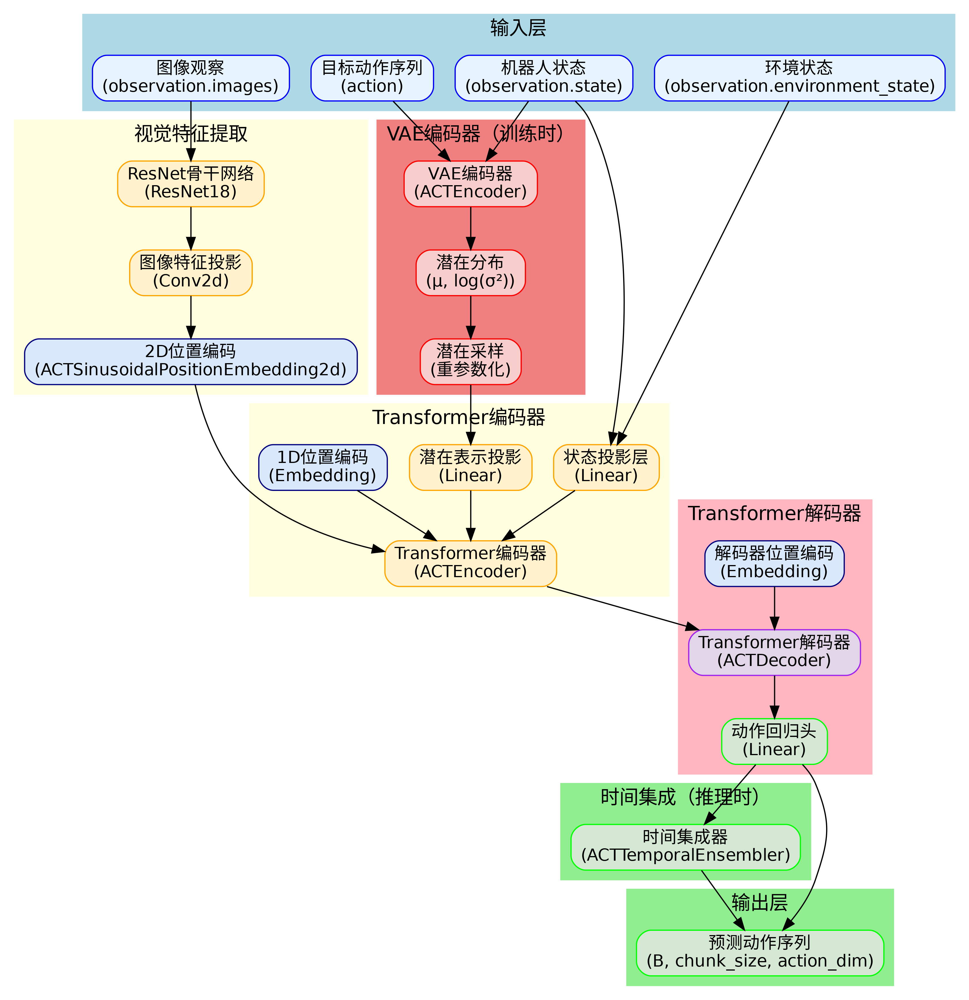

### 2.2 基于源码的神经网络结构图

ACT的神经网络结构基于源码实现，主要包含以下层次：

1. **输入层**：处理observation.images、observation.state、observation.environment_state和action
2. **VAE编码器层**：包含vae_encoder_cls_embed、vae_encoder_robot_state_input_proj、vae_encoder_action_input_proj等投影层
3. **视觉特征提取层**：backbone（ResNet18）、encoder_img_feat_input_proj（Conv2d）、encoder_cam_feat_pos_embed（2D位置编码）
4. **Transformer编码器层**：包含多个ACTEncoderLayer，每个层包含多头自注意力和前馈网络
5. **Transformer解码器层**：包含ACTDecoderLayer，实现自注意力和交叉注意力
6. **输出层**：action_head线性层生成最终动作预测

配图：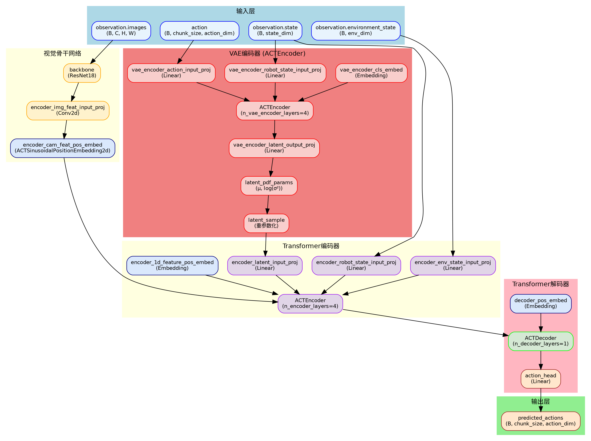

### 2.3 基于源码的流程图

#### 2.3.1 训练流程图

ACT的训练流程包括以下步骤：

1. **数据准备**：对输入和目标数据进行归一化处理
2. **VAE编码**：准备VAE编码器输入[cls, state, action]，通过ACTEncoder获取潜在分布参数
3. **特征提取**：图像通过ResNet18提取特征，状态通过线性层投影
4. **Transformer处理**：编码器融合多模态特征，解码器生成动作预测
5. **损失计算**：计算L1重构损失和KL散度损失，总损失为L = L_recon + β·L_KL

配图：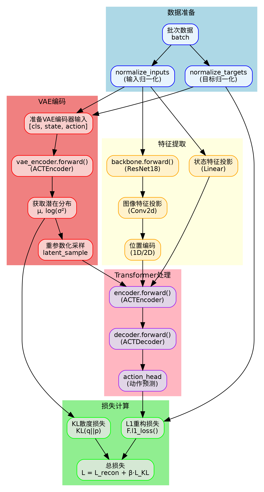

#### 2.3.2 推理流程图

ACT的推理流程包括以下步骤：

1. **输入处理**：对环境观察进行归一化，检查动作队列状态
2. **动作预测**：如果队列为空，调用predict_action_chunk()预测动作块
3. **时间集成**：如果启用时间集成，使用指数加权平均对历史预测进行集成
4. **动作执行**：返回单个动作执行到环境中

配图：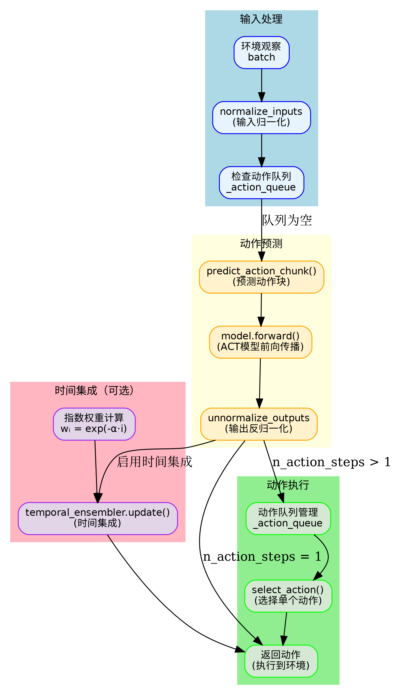

### 2.4 基于源码的函数调用关系图

ACT的函数调用关系体现了模块化的设计：

1. **ACTPolicy类**：主要的策略接口，包含select_action()、predict_action_chunk()、forward()等方法
2. **ACT模型类**：核心模型实现，包含VAE编码器、视觉骨干网络、Transformer编码器/解码器
3. **编码器层**：ACTEncoderLayer实现多头自注意力和前馈网络
4. **解码器层**：ACTDecoderLayer实现自注意力、交叉注意力和前馈网络
5. **时间集成器**：ACTTemporalEnsembler实现时间集成机制
6. **工具函数**：位置编码、激活函数等辅助功能

配图：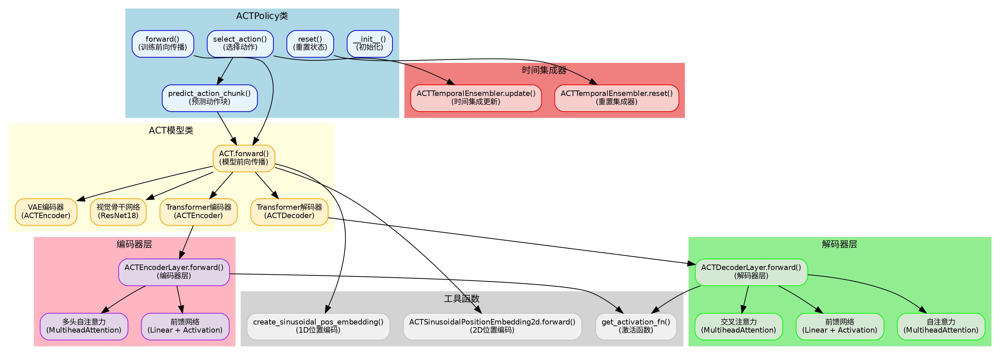

## 3. 架构知识点

### 3.1 动作分块机制

#### 3.1.1 动作分块机制讲解

动作分块机制是ACT模型的核心创新之一。传统的动作预测方法通常一次预测一个动作，而ACT将连续的动作序列分割成固定长度的chunks（默认chunk_size=100），一次预测整个动作块。这种设计有几个重要优势：

1. **长期依赖建模**：能够捕获动作序列中的长期依赖关系
2. **效率提升**：减少模型调用次数，提高推理效率
3. **一致性保证**：确保预测的动作序列在时间上的一致性

在源码中，动作分块通过以下方式实现：
- `chunk_size`参数控制动作块的大小
- `n_action_steps`参数控制每次执行的动作步数
- 动作队列机制管理动作的执行

#### 3.1.2 数学/算法推导

动作分块可以形式化表示为：

给定连续动作序列 A = [a₀, a₁, ..., aₙ]，将其分割为chunks：
Cᵢ = [a_{i·chunk_size}, a_{i·chunk_size+1}, ..., a_{(i+1)·chunk_size-1}]

模型预测：f(Cᵢ) = [â_{i·chunk_size}, â_{i·chunk_size+1}, ..., â_{(i+1)·chunk_size-1}]

其中f是ACT模型，â是预测的动作。

#### 3.1.3 动作分块机制配图

配图：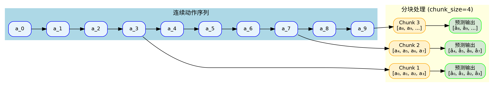

#### 3.1.4 源码片段与讲解

```python
# configuration_act.py
chunk_size: int = 100  # 动作块大小，即一次预测的动作序列长度
n_action_steps: int = 100  # 每次执行的动作步骤数

# modeling_act.py - select_action方法
if len(self._action_queue) == 0:
    # 预测动作块，只取前n_action_steps个动作
    actions = self.predict_action_chunk(batch)[:, : self.config.n_action_steps]
    # 将预测的动作块放入队列
    self._action_queue.extend(actions.transpose(0, 1))
return self._action_queue.popleft()
```

源码解析：
- `chunk_size`定义了模型一次预测的动作序列长度
- `n_action_steps`控制实际执行的动作步数，可以小于等于chunk_size
- 动作队列机制确保动作按顺序执行，避免重复预测

### 3.2 多模态融合

#### 3.2.1 多模态融合讲解

ACT模型需要处理多种输入模态，包括图像观察、机器人状态、环境状态和潜在表示。多模态融合技术将这些不同模态的信息有效地整合到统一的表示空间中。

多模态融合的关键挑战：
1. **模态差异**：不同模态的数据格式和语义含义差异很大
2. **特征对齐**：需要将不同模态的特征映射到相同的维度空间
3. **信息整合**：有效融合不同模态的信息，避免信息丢失

ACT采用Transformer架构进行多模态融合，通过注意力机制实现模态间的交互。

#### 3.2.2 多模态融合配图

配图：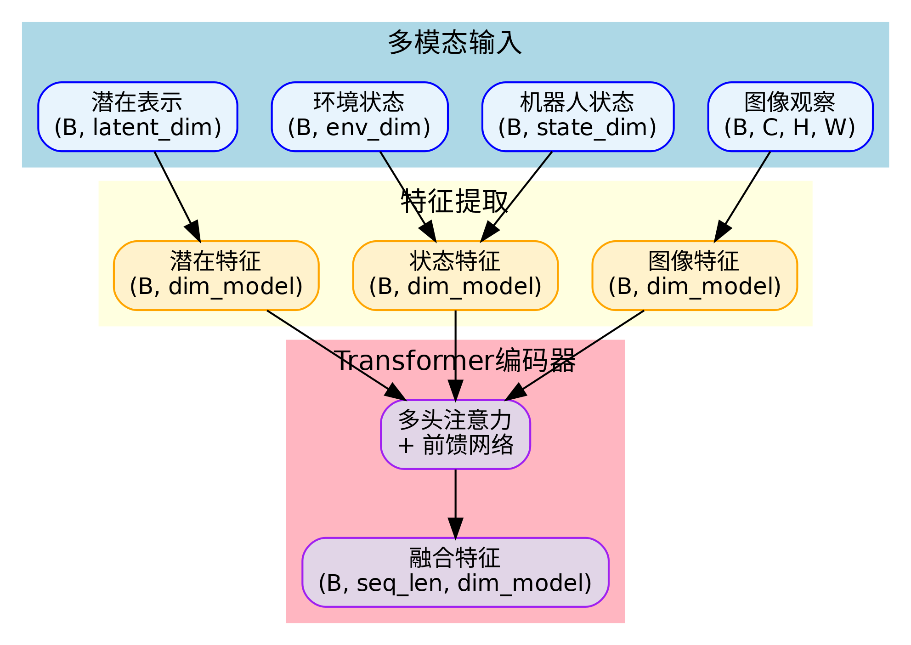

#### 3.2.3 源码片段与讲解

```python
# modeling_act.py - ACT.forward方法
# 准备transformer编码器输入
encoder_in_tokens = [self.encoder_latent_input_proj(latent_sample)]
encoder_in_pos_embed = list(self.encoder_1d_feature_pos_embed.weight.unsqueeze(1))

# 机器人状态token
if self.config.robot_state_feature:
    encoder_in_tokens.append(self.encoder_robot_state_input_proj(batch["observation.state"]))

# 环境状态token
if self.config.env_state_feature:
    encoder_in_tokens.append(self.encoder_env_state_input_proj(batch["observation.environment_state"]))

# 相机观察特征和位置嵌入
if self.config.image_features:
    for img in batch["observation.images"]:
        cam_features = self.backbone(img)["feature_map"]
        cam_pos_embed = self.encoder_cam_feat_pos_embed(cam_features)
        cam_features = self.encoder_img_feat_input_proj(cam_features)
        # 重新排列特征为(sequence, batch, dim)
        cam_features = einops.rearrange(cam_features, "b c h w -> (h w) b c")
        encoder_in_tokens.extend(cam_features)
```

源码解析：
- 通过不同的投影层将各模态映射到相同的维度空间
- 使用位置编码区分不同模态的token
- 将所有token堆叠后输入Transformer编码器进行融合

### 3.3 变分自编码器

#### 3.3.1 变分自编码器讲解

ACT使用变分自编码器（VAE）来学习动作序列的潜在表示。VAE的核心思想是将输入数据编码为潜在空间的概率分布，然后从该分布中采样进行解码重构。

VAE的优势：
1. **潜在空间结构**：学习到有意义的潜在表示
2. **生成能力**：能够生成多样化的动作序列
3. **正则化效果**：KL散度损失提供正则化，防止过拟合

在ACT中，VAE编码器将动作序列和机器人状态编码为潜在分布，解码器（Transformer）从潜在表示生成动作序列。

#### 3.3.2 数学/算法推导

VAE的数学原理基于变分推断：

**编码器**：q(z|x) = N(μ(x), σ²(x))
**解码器**：p(x|z) = N(μ'(z), σ'²(z))

**损失函数**：
L = E_{q(z|x)}[log p(x|z)] - KL(q(z|x)||p(z))

其中：
- 第一项是重构损失，衡量重构质量
- 第二项是KL散度，衡量编码分布与先验分布的差异
- p(z) = N(0, I)是标准正态先验

#### 3.3.3 变分自编码器配图

配图：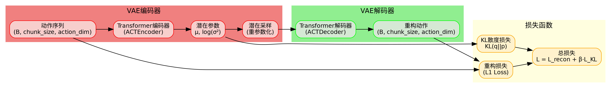

#### 3.3.4 源码片段与讲解

```python
# modeling_act.py - ACT.forward方法
# 通过VAE编码器前向传播以获得潜在PDF参数
cls_token_out = self.vae_encoder(
    vae_encoder_input.permute(1, 0, 2),
    pos_embed=pos_embed.permute(1, 0, 2),
    key_padding_mask=key_padding_mask,
)[0]  # 选择类别token，形状为(B, D)

latent_pdf_params = self.vae_encoder_latent_output_proj(cls_token_out)
mu = latent_pdf_params[:, : self.config.latent_dim]
log_sigma_x2 = latent_pdf_params[:, self.config.latent_dim :]

# 使用重参数化技巧采样潜在表示
latent_sample = mu + log_sigma_x2.div(2).exp() * torch.randn_like(mu)

# 损失计算
if self.config.use_vae:
    # 计算KL散度损失
    mean_kld = (
        (-0.5 * (1 + log_sigma_x2 - mu.pow(2) - (log_sigma_x2).exp())).sum(-1).mean()
    )
    # 总损失 = 重构损失 + KL散度损失
    loss = l1_loss + mean_kld * self.config.kl_weight
```

源码解析：
- VAE编码器输出潜在分布的参数μ和log(σ²)
- 使用重参数化技巧进行采样：z = μ + σ·ε，其中ε~N(0,1)
- KL散度损失确保潜在分布接近标准正态分布

### 3.4 Transformer架构

#### 3.4.1 Transformer架构讲解

ACT采用标准的Transformer编码器-解码器架构，这是处理序列数据的强大模型。Transformer的核心组件包括：

1. **多头自注意力机制**：允许模型关注序列中的不同位置
2. **位置编码**：为序列中的每个位置提供位置信息
3. **前馈网络**：非线性变换层
4. **残差连接和层归一化**：稳定训练过程

在ACT中，编码器处理多模态输入，解码器生成动作序列。编码器-解码器架构特别适合序列到序列的任务。

#### 3.4.2 数学/算法推导

**多头注意力机制**：
MultiHead(Q,K,V) = Concat(head₁,...,headₕ)W^O

其中每个head：
headᵢ = Attention(QWᵢ^Q, KWᵢ^K, VWᵢ^V)

**注意力计算**：
Attention(Q,K,V) = softmax(QK^T/√d_k)V

**位置编码**：
PE(pos,2i) = sin(pos/10000^(2i/d_model))
PE(pos,2i+1) = cos(pos/10000^(2i/d_model))

#### 3.4.3 源码片段与讲解

```python
# modeling_act.py - ACTEncoderLayer
class ACTEncoderLayer(nn.Module):
    def __init__(self, config: ACTConfig):
        super().__init__()
        # 多头自注意力层
        self.self_attn = nn.MultiheadAttention(config.dim_model, config.n_heads, dropout=config.dropout)
        # 前馈层
        self.linear1 = nn.Linear(config.dim_model, config.dim_feedforward)
        self.linear2 = nn.Linear(config.dim_feedforward, config.dim_model)
        # 层归一化和dropout
        self.norm1 = nn.LayerNorm(config.dim_model)
        self.norm2 = nn.LayerNorm(config.dim_model)
        self.dropout1 = nn.Dropout(config.dropout)
        self.dropout2 = nn.Dropout(config.dropout)

    def forward(self, x, pos_embed=None, key_padding_mask=None):
        skip = x
        if self.pre_norm:
            x = self.norm1(x)
        q = k = x if pos_embed is None else x + pos_embed
        x = self.self_attn(q, k, value=x, key_padding_mask=key_padding_mask)[0]
        x = skip + self.dropout1(x)
        # 前馈网络
        if self.pre_norm:
            skip = x
            x = self.norm2(x)
        x = self.linear2(self.dropout(self.activation(self.linear1(x))))
        x = skip + self.dropout2(x)
        return x
```

源码解析：
- 实现了标准的Transformer编码器层
- 包含多头自注意力、前馈网络、残差连接和层归一化
- 支持pre-norm和post-norm两种模式
- 支持位置编码和填充掩码

## 4. 主要技术点

### 4.1 时间集成推理

#### 4.1.1 时间集成推理讲解

时间集成是ACT在推理阶段使用的一种技术，通过指数加权平均对历史预测动作进行集成，提高推理的稳定性和鲁棒性。这种方法可以减少单次预测的噪声，提高动作的平滑性。

时间集成的核心思想是：
1. **历史信息利用**：利用之前时间步的预测信息
2. **指数衰减权重**：较近的预测具有更高的权重
3. **平滑效果**：减少预测的抖动和不稳定性

#### 4.1.2 数学/算法推导

时间集成使用指数加权平均：

wᵢ = exp(-α·i)

其中：
- wᵢ是第i个历史预测的权重
- α是时间集成系数（temporal_ensemble_coeff）
- i是时间步索引

集成后的动作：
a_final = Σ(wᵢ × aᵢ) / Σwᵢ

#### 4.1.3 时间集成推理配图

配图：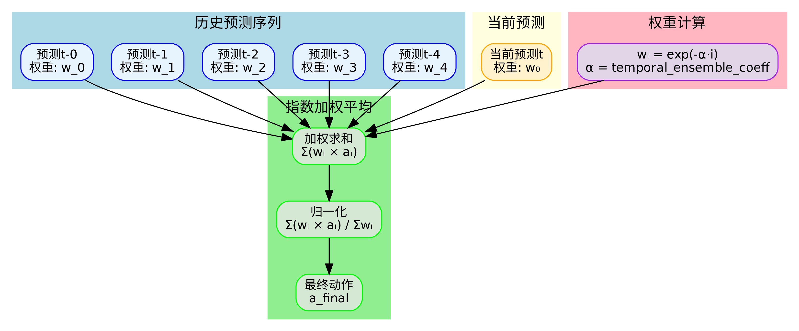

#### 4.1.4 源码片段与讲解

```python
# modeling_act.py - ACTTemporalEnsembler
class ACTTemporalEnsembler:
    def __init__(self, temporal_ensemble_coeff: float, chunk_size: int) -> None:
        self.chunk_size = chunk_size
        # 计算指数权重：wᵢ = exp(-temporal_ensemble_coeff * i)
        self.ensemble_weights = torch.exp(-temporal_ensemble_coeff * torch.arange(chunk_size))
        # 计算权重累积和，用于归一化
        self.ensemble_weights_cumsum = torch.cumsum(self.ensemble_weights, dim=0)
        self.reset()

    def update(self, actions: Tensor) -> Tensor:
        # 确保权重张量在正确的设备上
        self.ensemble_weights = self.ensemble_weights.to(device=actions.device)
        self.ensemble_weights_cumsum = self.ensemble_weights_cumsum.to(device=actions.device)
        
        if self.ensembled_actions is None:
            # 初始化
            self.ensembled_actions = actions.clone()
            self.ensembled_actions_count = torch.ones(
                (self.chunk_size, 1), dtype=torch.long, device=actions.device
            )
        else:
            # 在线更新集成动作
            self.ensembled_actions *= self.ensemble_weights_cumsum[self.ensembled_actions_count - 1]
            self.ensembled_actions += actions[:, :-1] * self.ensemble_weights[self.ensembled_actions_count]
            self.ensembled_actions /= self.ensemble_weights_cumsum[self.ensembled_actions_count]
            self.ensembled_actions_count = torch.clamp(self.ensembled_actions_count + 1, max=self.chunk_size)
        
        # "消耗"第一个动作
        action, self.ensembled_actions, self.ensembled_actions_count = (
            self.ensembled_actions[:, 0],
            self.ensembled_actions[:, 1:],
            self.ensembled_actions_count[1:],
        )
        return action
```

源码解析：
- 使用指数权重计算历史预测的重要性
- 在线更新机制，实时维护集成状态
- 权重归一化确保数值稳定性
- 支持设备间张量转移

### 4.2 位置编码机制

#### 4.2.1 位置编码机制讲解

位置编码是Transformer架构的重要组成部分，为序列中的每个位置提供位置信息。ACT使用两种位置编码：

1. **1D正弦位置编码**：用于序列数据（如动作序列、状态序列）
2. **2D正弦位置编码**：用于图像特征（考虑空间位置信息）

位置编码的作用：
- 为Transformer提供位置信息
- 允许模型理解序列中的相对位置关系
- 支持不同长度的序列输入

#### 4.2.2 数学/算法推导

**1D正弦位置编码**：
PE(pos,2i) = sin(pos/10000^(2i/d_model))
PE(pos,2i+1) = cos(pos/10000^(2i/d_model))

**2D正弦位置编码**：
对于位置(x,y)：
PE_x(x,2i) = sin(x/10000^(2i/d_model))
PE_x(x,2i+1) = cos(x/10000^(2i/d_model))
PE_y(y,2i) = sin(y/10000^(2i/d_model))
PE_y(y,2i+1) = cos(y/10000^(2i/d_model))

最终2D位置编码：PE(x,y) = [PE_y, PE_x]

#### 4.2.3 位置编码机制配图

配图：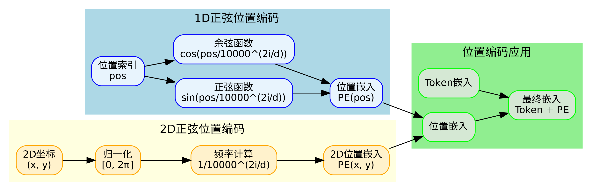

#### 4.2.4 源码片段与讲解

```python
# modeling_act.py - 1D位置编码
def create_sinusoidal_pos_embedding(num_positions: int, dimension: int) -> Tensor:
    """1D正弦位置嵌入，如《Attention is All You Need》中所述"""
    def get_position_angle_vec(position):
        return [position / np.power(10000, 2 * (hid_j // 2) / dimension) for hid_j in range(dimension)]

    sinusoid_table = np.array([get_position_angle_vec(pos_i) for pos_i in range(num_positions)])
    sinusoid_table[:, 0::2] = np.sin(sinusoid_table[:, 0::2])  # dim 2i
    sinusoid_table[:, 1::2] = np.cos(sinusoid_table[:, 1::2])  # dim 2i+1
    return torch.from_numpy(sinusoid_table).float()

# modeling_act.py - 2D位置编码
class ACTSinusoidalPositionEmbedding2d(nn.Module):
    def __init__(self, dimension: int):
        super().__init__()
        self.dimension = dimension
        self._two_pi = 2 * math.pi
        self._eps = 1e-6
        self._temperature = 10000

    def forward(self, x: Tensor) -> Tensor:
        not_mask = torch.ones_like(x[0, :1])  # (1, H, W)
        y_range = not_mask.cumsum(1, dtype=torch.float32)
        x_range = not_mask.cumsum(2, dtype=torch.float32)

        # 归一化到[0, 2π]
        y_range = y_range / (y_range[:, -1:, :] + self._eps) * self._two_pi
        x_range = x_range / (x_range[:, :, -1:] + self._eps) * self._two_pi

        inverse_frequency = self._temperature ** (
            2 * (torch.arange(self.dimension, dtype=torch.float32, device=x.device) // 2) / self.dimension
        )

        x_range = x_range.unsqueeze(-1) / inverse_frequency
        y_range = y_range.unsqueeze(-1) / inverse_frequency

        # 生成正弦和余弦项
        pos_embed_x = torch.stack((x_range[..., 0::2].sin(), x_range[..., 1::2].cos()), dim=-1).flatten(3)
        pos_embed_y = torch.stack((y_range[..., 0::2].sin(), y_range[..., 1::2].cos()), dim=-1).flatten(3)
        pos_embed = torch.cat((pos_embed_y, pos_embed_x), dim=3).permute(0, 3, 1, 2)
        
        return pos_embed
```

源码解析：
- 1D位置编码按照原始Transformer论文实现
- 2D位置编码考虑图像的空间位置信息
- 使用温度参数控制频率衰减
- 支持不同维度的位置编码

### 4.3 归一化策略

#### 4.3.1 归一化策略讲解

ACT使用多种归一化策略来处理不同模态的输入和输出数据：

1. **输入归一化**：将输入数据标准化到合适的范围
2. **输出反归一化**：将模型输出转换回原始尺度
3. **目标归一化**：训练时对目标数据进行标准化

归一化的作用：
- 提高训练稳定性
- 加速收敛
- 处理不同模态的数据尺度差异

#### 4.3.2 源码片段与讲解

```python
# configuration_act.py
normalization_mapping: dict[str, NormalizationMode] = field(
    default_factory=lambda: {
        "VISUAL": NormalizationMode.MEAN_STD,  # 视觉数据使用均值标准差归一化
        "STATE": NormalizationMode.MEAN_STD,   # 状态数据使用均值标准差归一化
        "ACTION": NormalizationMode.MEAN_STD,  # 动作数据使用均值标准差归一化
    }
)

# modeling_act.py - ACTPolicy.__init__
# 初始化归一化模块
self.normalize_inputs = Normalize(config.input_features, config.normalization_mapping, dataset_stats)
self.normalize_targets = Normalize(config.output_features, config.normalization_mapping, dataset_stats)
self.unnormalize_outputs = Unnormalize(config.output_features, config.normalization_mapping, dataset_stats)

# modeling_act.py - forward方法
# 对输入数据进行归一化
batch = self.normalize_inputs(batch)
# 对目标数据进行归一化
batch = self.normalize_targets(batch)

# modeling_act.py - predict_action_chunk方法
# 对输入数据进行归一化
batch = self.normalize_inputs(batch)
# 将预测结果反归一化到原始尺度
actions = self.unnormalize_outputs({ACTION: actions})[ACTION]
```

源码解析：
- 支持多种归一化模式（均值标准差、最小最大值）
- 针对不同模态使用不同的归一化策略
- 训练时对输入和目标都进行归一化
- 推理时将输出反归一化到原始尺度

### 4.4 注意力机制

#### 4.4.1 注意力机制讲解

ACT使用多种注意力机制来处理不同层次的信息交互：

1. **自注意力**：在编码器和解码器中，允许序列内部的位置相互关注
2. **交叉注意力**：在解码器中，允许解码器关注编码器的输出
3. **多头注意力**：将注意力机制并行化，关注不同的表示子空间

注意力机制的优势：
- 捕获长距离依赖关系
- 动态权重分配
- 并行计算效率高

#### 4.4.2 数学/算法推导

**注意力计算**：
Attention(Q,K,V) = softmax(QK^T/√d_k)V

**多头注意力**：
MultiHead(Q,K,V) = Concat(head₁,...,headₕ)W^O

其中：
headᵢ = Attention(QWᵢ^Q, KWᵢ^K, VWᵢ^V)

#### 4.4.3 注意力机制配图

**自注意力机制**：
配图：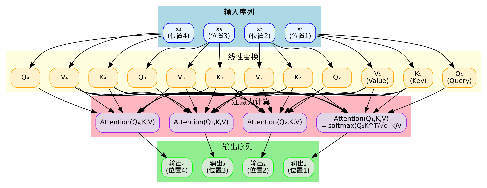

**交叉注意力机制**：
配图：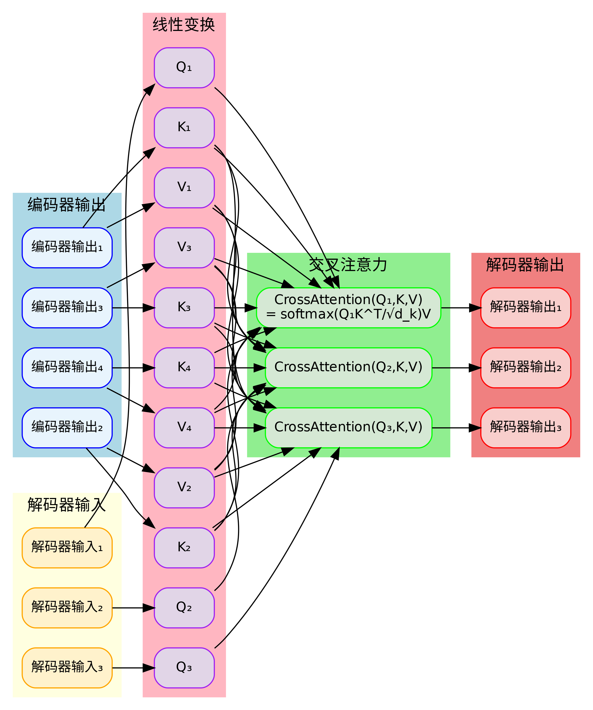

**多头注意力机制**：
配图：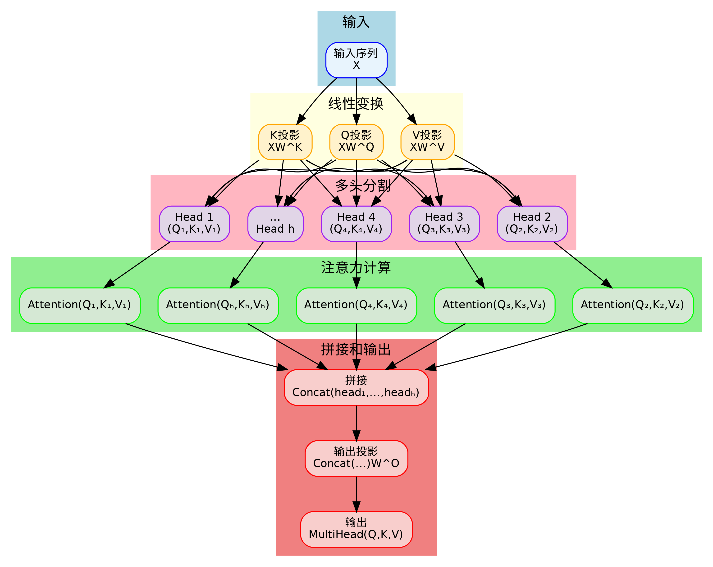

**注意力公式图解**：
配图：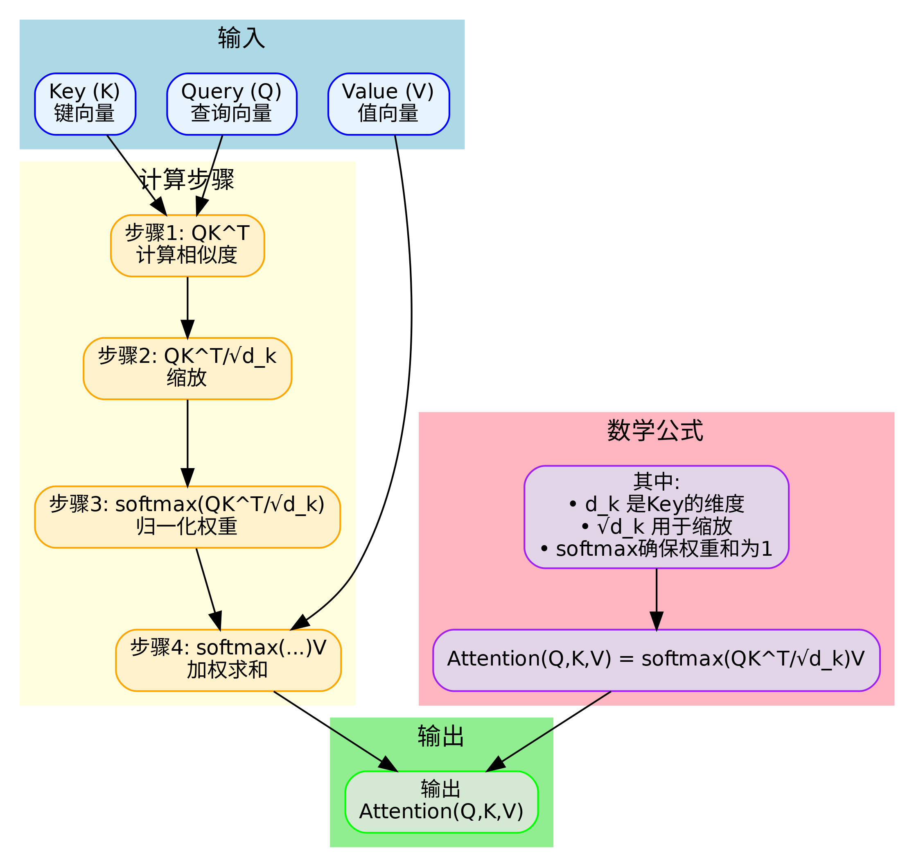

#### 4.4.4 源码片段与讲解

```python
# modeling_act.py - ACTEncoderLayer
class ACTEncoderLayer(nn.Module):
    def __init__(self, config: ACTConfig):
        super().__init__()
        # 多头自注意力层
        self.self_attn = nn.MultiheadAttention(config.dim_model, config.n_heads, dropout=config.dropout)

    def forward(self, x, pos_embed=None, key_padding_mask=None):
        q = k = x if pos_embed is None else x + pos_embed
        x = self.self_attn(q, k, value=x, key_padding_mask=key_padding_mask)[0]
        return x

# modeling_act.py - ACTDecoderLayer
class ACTDecoderLayer(nn.Module):
    def __init__(self, config: ACTConfig):
        super().__init__()
        # 多头自注意力层
        self.self_attn = nn.MultiheadAttention(config.dim_model, config.n_heads, dropout=config.dropout)
        # 多头交叉注意力层
        self.multihead_attn = nn.MultiheadAttention(config.dim_model, config.n_heads, dropout=config.dropout)

    def forward(self, x, encoder_out, decoder_pos_embed=None, encoder_pos_embed=None):
        # 自注意力
        q = k = self.maybe_add_pos_embed(x, decoder_pos_embed)
        x = self.self_attn(q, k, value=x)[0]
        
        # 交叉注意力
        x = self.multihead_attn(
            query=self.maybe_add_pos_embed(x, decoder_pos_embed),
            key=self.maybe_add_pos_embed(encoder_out, encoder_pos_embed),
            value=encoder_out,
        )[0]
        return x
```

源码解析：
- 编码器层使用自注意力处理输入序列
- 解码器层使用自注意力和交叉注意力
- 支持位置编码和填充掩码
- 使用PyTorch的MultiheadAttention实现

---

## 总结

ACT（Action Chunking Transformer）是一个创新的机器人动作预测策略，通过动作分块、多模态融合、VAE变分学习和时间集成等技术，在双臂精细操作任务中取得了出色的性能。该模型的设计充分考虑了机器人控制的实际需求，提供了高效、稳定和可扩展的解决方案。

主要技术贡献包括：
1. 动作分块机制提高了长期依赖建模能力
2. 多模态融合技术有效整合了视觉和状态信息
3. VAE变分学习提供了丰富的潜在表示
4. 时间集成推理提高了实际部署的稳定性

ACT的成功为机器人学习领域提供了重要的技术参考，特别是在处理复杂精细操作任务方面具有重要的应用价值。 