# Diffusion Policy 学习文档

## 1. Diffusion Policy 概述

Diffusion Policy 是一种基于扩散模型的视觉运动策略学习方法，通过将机器人动作生成建模为扩散过程来实现端到端的策略学习。该模型能够处理多模态观察输入（包括机器人状态、视觉图像和环境状态），并生成时序动作序列。其核心亮点在于将扩散模型的生成能力应用于机器人控制任务，通过条件扩散过程实现高质量的动作序列预测，同时具备良好的泛化能力和鲁棒性。

## 2. 模型架构

### 2.1 架构讲解

Diffusion Policy 采用了一种层次化的架构设计，主要包含以下几个核心组件：

1. **多模态观察处理层**：处理机器人状态、视觉图像和环境状态等多种输入模态
2. **特征编码层**：将不同模态的观察转换为统一的特征表示
3. **特征融合层**：将多模态特征融合为全局条件信息
4. **扩散模型层**：基于条件U-Net的扩散过程，实现动作序列的生成
5. **队列管理机制**：维护观察和动作的历史信息，支持时序推理

整个架构的设计充分考虑了机器人控制任务的特点，通过扩散模型的不确定性建模能力，能够生成多样化的动作策略，同时保持动作的连续性和合理性。

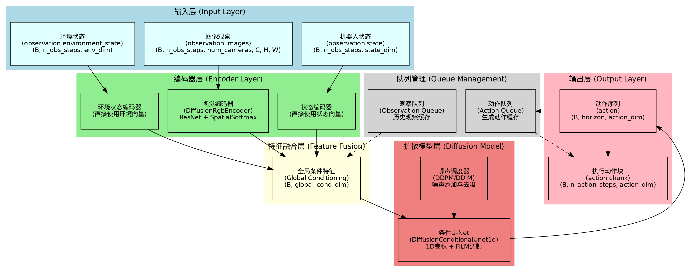

### 2.2 基于源码的神经网络结构图

从源码分析可以看出，Diffusion Policy 的神经网络结构主要包含以下几个核心类：

- **DiffusionPolicy**：主策略类，负责整体流程控制
- **DiffusionModel**：核心扩散模型，包含U-Net和噪声调度器
- **DiffusionRgbEncoder**：视觉特征编码器，基于ResNet和SpatialSoftmax
- **DiffusionConditionalUnet1d**：条件U-Net网络，使用1D卷积处理时序数据
- **DiffusionConditionalResidualBlock1d**：残差块，包含FiLM调制机制

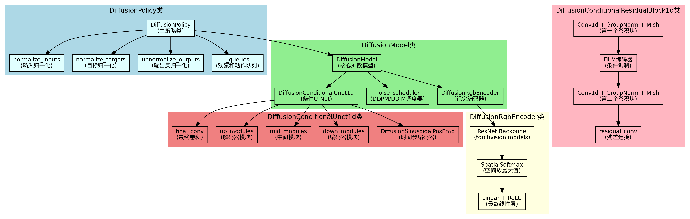

### 2.3 基于源码的流程图

#### 2.3.1 训练流程图

训练过程主要包括数据预处理、特征编码、扩散过程、模型预测和损失计算等步骤。整个流程确保了模型能够学习到从观察到动作序列的映射关系。

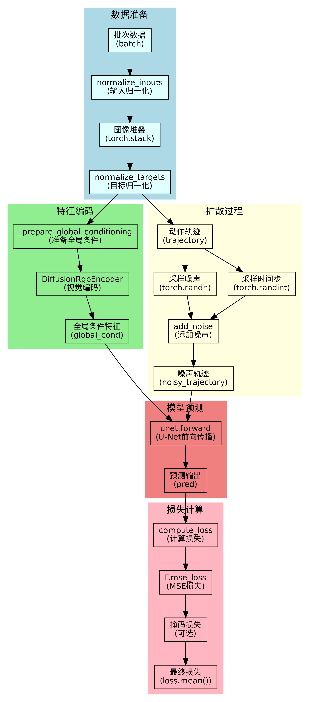

#### 2.3.2 推理流程图

推理过程通过队列机制管理观察和动作的历史信息，实现了高效的时序动作生成。推理流程包括观察处理、队列管理、动作生成和动作选择等关键步骤。

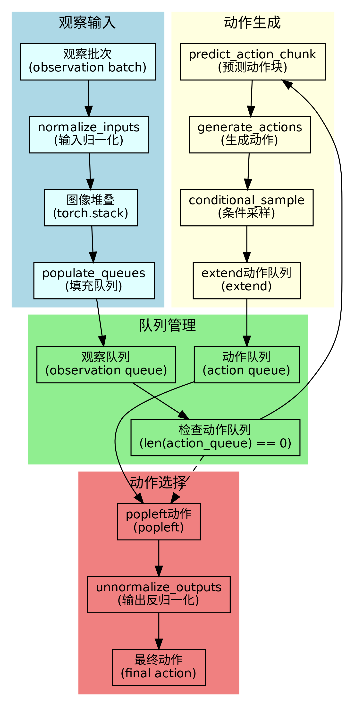

### 2.4 基于源码的函数调用关系图

#### 2.4.1 训练函数调用

训练过程中的函数调用关系展示了从数据输入到损失计算的完整调用链，包括数据预处理、特征编码、扩散过程和损失计算等关键函数。

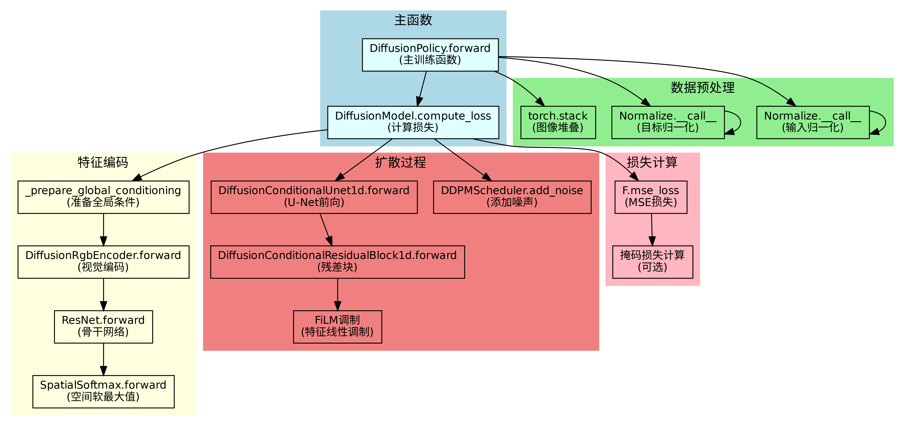

#### 2.4.2 推理函数调用

推理过程中的函数调用关系展示了从观察输入到动作输出的完整调用链，包括数据预处理、特征编码、扩散采样和后处理等关键函数。

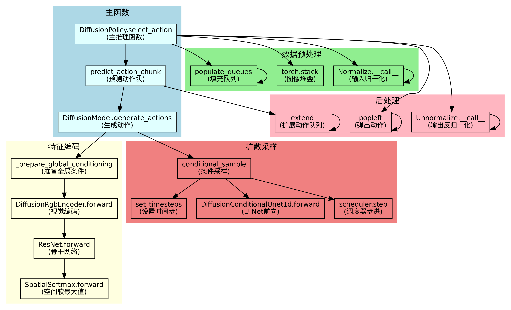

## 3. 架构知识点

### 3.1 多模态观察融合

#### 3.1.1 多模态观察融合讲解

多模态观察融合是Diffusion Policy的核心技术之一，它能够处理来自不同传感器的多种观察模态，包括机器人状态、视觉图像和环境状态。这种融合机制使得模型能够充分利用各种观察信息，提高动作生成的准确性和鲁棒性。

在机器人控制任务中，不同的观察模态提供了互补的信息：机器人状态提供了当前配置的精确信息，视觉图像提供了环境的空间信息，环境状态提供了任务相关的上下文信息。通过有效的融合机制，模型能够综合这些信息，生成更加合理和有效的动作序列。

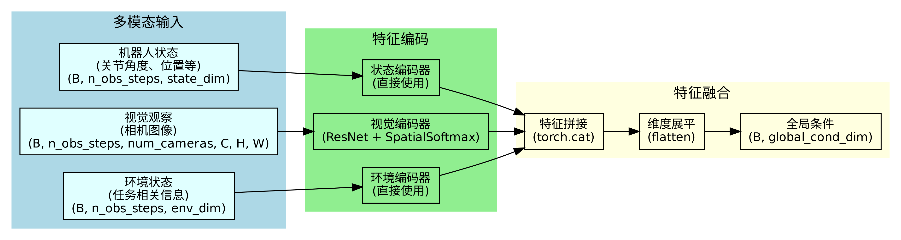

#### 3.1.2 源码片段与讲解

```python
def _prepare_global_conditioning(self, batch: dict[str, Tensor]) -> Tensor:
    """Encode image features and concatenate them all together along with the state vector."""
    batch_size, n_obs_steps = batch[OBS_STATE].shape[:2]
    global_cond_feats = [batch[OBS_STATE]]
    
    # Extract image features.
    if self.config.image_features:
        if self.config.use_separate_rgb_encoder_per_camera:
            # Combine batch and sequence dims while rearranging to make the camera index dimension first.
            images_per_camera = einops.rearrange(batch["observation.images"], "b s n ... -> n (b s) ...")
            img_features_list = torch.cat([
                encoder(images)
                for encoder, images in zip(self.rgb_encoder, images_per_camera, strict=True)
            ])
            # Separate batch and sequence dims back out.
            img_features = einops.rearrange(
                img_features_list, "(n b s) ... -> b s (n ...)", b=batch_size, s=n_obs_steps
            )
        else:
            # Combine batch, sequence, and "which camera" dims before passing to shared encoder.
            img_features = self.rgb_encoder(
                einops.rearrange(batch["observation.images"], "b s n ... -> (b s n) ...")
            )
            # Separate batch dim and sequence dim back out.
            img_features = einops.rearrange(
                img_features, "(b s n) ... -> b s (n ...)", b=batch_size, s=n_obs_steps
            )
        global_cond_feats.append(img_features)

    if self.config.env_state_feature:
        global_cond_feats.append(batch[OBS_ENV_STATE])

    # Concatenate features then flatten to (B, global_cond_dim).
    return torch.cat(global_cond_feats, dim=-1).flatten(start_dim=1)
```

这段代码展示了多模态观察融合的核心实现。首先，代码将机器人状态作为基础特征，然后根据配置决定是否处理图像特征和环境状态特征。对于图像特征，支持两种处理方式：为每个相机使用独立的编码器，或者使用共享编码器。最后，将所有特征拼接并展平，形成全局条件特征。

### 3.2 时序动作生成

#### 3.2.1 时序动作生成讲解

时序动作生成是Diffusion Policy的另一个核心技术，它能够基于历史观察信息生成未来多个时间步的动作序列。这种时序生成能力使得机器人能够进行前瞻性的规划，而不是仅仅基于当前状态做出反应性的决策。

时序动作生成的关键在于理解观察和动作之间的时序关系。模型需要从历史观察中提取时序模式，并预测未来动作序列。这种能力对于需要连续动作的机器人任务特别重要，如抓取、搬运等操作。

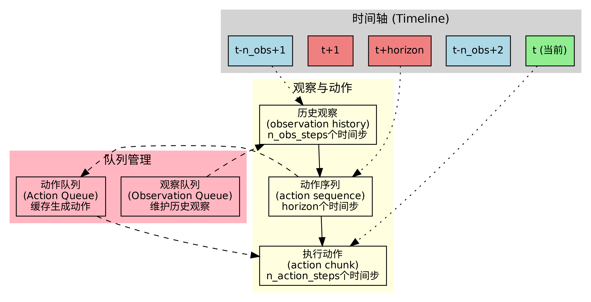

#### 3.2.2 源码片段与讲解

```python
def select_action(self, batch: dict[str, Tensor]) -> Tensor:
    """Select a single action given environment observations.
    
    This method handles caching a history of observations and an action trajectory generated by the
    underlying diffusion model. Here's how it works:
      - `n_obs_steps` steps worth of observations are cached (for the first steps, the observation is
        copied `n_obs_steps` times to fill the cache).
      - The diffusion model generates `horizon` steps worth of actions.
      - `n_action_steps` worth of actions are actually kept for execution, starting from the current step.
    """
    # NOTE: for offline evaluation, we have action in the batch, so we need to pop it out
    if ACTION in batch:
        batch.pop(ACTION)

    batch = self.normalize_inputs(batch)
    if self.config.image_features:
        batch = dict(batch)  # shallow copy so that adding a key doesn't modify the original
        batch[OBS_IMAGES] = torch.stack([batch[key] for key in self.config.image_features], dim=-4)
    
    # NOTE: It's important that this happens after stacking the images into a single key.
    self._queues = populate_queues(self._queues, batch)

    if len(self._queues[ACTION]) == 0:
        actions = self.predict_action_chunk(batch)
        self._queues[ACTION].extend(actions.transpose(0, 1))

    action = self._queues[ACTION].popleft()
    return action
```

这段代码展示了时序动作生成的核心逻辑。方法首先处理输入观察，然后检查动作队列是否为空。如果队列为空，则调用扩散模型生成新的动作序列并添加到队列中。最后，从队列中取出一个动作作为当前时间步的执行动作。这种设计确保了动作的连续性和时序一致性。

### 3.3 条件扩散建模

#### 3.3.1 条件扩散建模讲解

条件扩散建模是Diffusion Policy的核心创新，它将传统的扩散模型扩展为条件生成模型，能够根据观察信息生成相应的动作序列。这种条件建模方式使得模型能够学习观察和动作之间的复杂映射关系。

条件扩散建模的关键在于如何有效地将条件信息（观察特征）融入到扩散过程中。模型使用FiLM（Feature Linear Modulation）技术来实现条件调制，通过生成缩放和偏置参数来调制网络的特征表示。

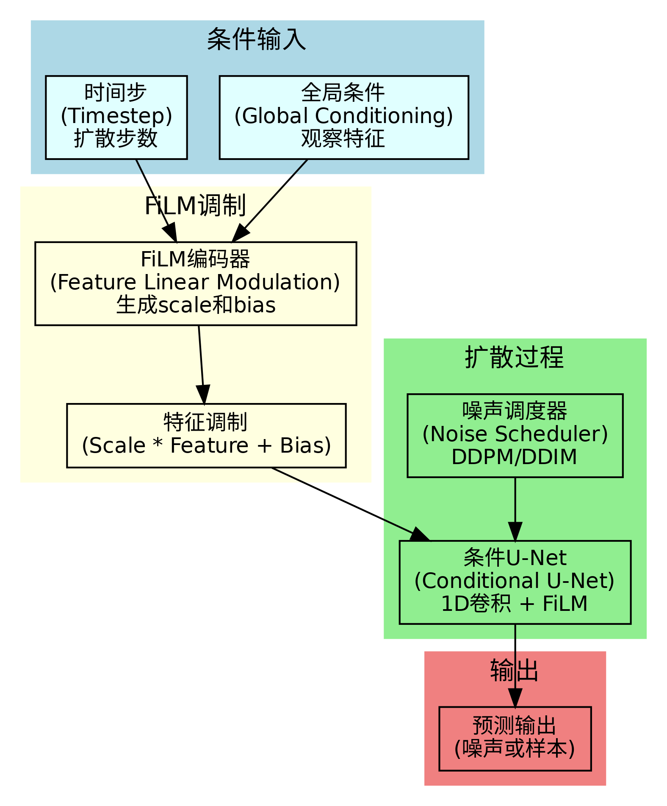

#### 3.3.2 源码片段与讲解

```python
def conditional_sample(
    self, batch_size: int, global_cond: Tensor | None = None, generator: torch.Generator | None = None
) -> Tensor:
    device = get_device_from_parameters(self)
    dtype = get_dtype_from_parameters(self)

    # Sample prior.
    sample = torch.randn(
        size=(batch_size, self.config.horizon, self.config.action_feature.shape[0]),
        dtype=dtype,
        device=device,
        generator=generator,
    )

    self.noise_scheduler.set_timesteps(self.num_inference_steps)

    for t in self.noise_scheduler.timesteps:
        # Predict model output.
        model_output = self.unet(
            sample,
            torch.full(sample.shape[:1], t, dtype=torch.long, device=sample.device),
            global_cond=global_cond,
        )
        # Compute previous image: x_t -> x_t-1
        sample = self.noise_scheduler.step(model_output, t, sample, generator=generator).prev_sample

    return sample
```

这段代码展示了条件扩散采样的核心实现。方法首先从标准正态分布采样初始噪声，然后通过迭代的去噪过程生成动作序列。在每一步去噪过程中，U-Net网络接收当前的噪声样本、时间步和全局条件信息，预测去噪后的样本。这种条件采样过程确保了生成的动作序列与观察信息保持一致。

### 3.4 队列缓存机制

#### 3.4.1 队列缓存机制讲解

队列缓存机制是Diffusion Policy实现高效时序推理的关键技术。通过维护观察和动作的历史队列，模型能够在不重复计算的情况下，连续地生成和执行动作序列。这种机制大大提高了推理效率，使得模型能够在实时控制任务中应用。

队列缓存机制的核心思想是预计算和缓存。模型一次性生成多个时间步的动作序列，然后按需从缓存中取出执行。当缓存耗尽时，模型再次生成新的动作序列。这种设计平衡了计算效率和动作质量。

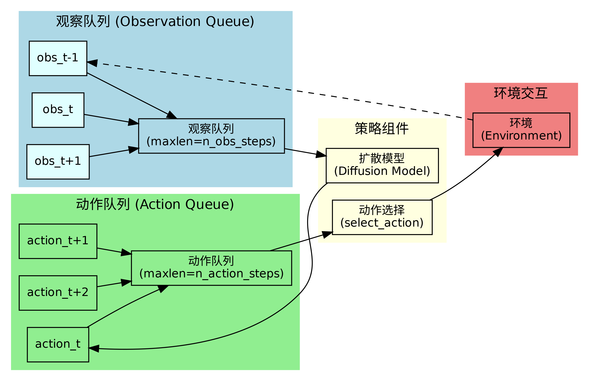

#### 3.4.2 源码片段与讲解

```python
def reset(self):
    """Clear observation and action queues. Should be called on `env.reset()`"""
    self._queues = {
        "observation.state": deque(maxlen=self.config.n_obs_steps),
        "action": deque(maxlen=self.config.n_action_steps),
    }
    if self.config.image_features:
        self._queues["observation.images"] = deque(maxlen=self.config.n_obs_steps)
    if self.config.env_state_feature:
        self._queues["observation.environment_state"] = deque(maxlen=self.config.n_obs_steps)
```

这段代码展示了队列缓存机制的初始化。方法创建了多个双端队列来存储不同类型的观察和动作信息。每个队列都有最大长度限制，确保内存使用不会无限增长。当环境重置时，这些队列会被清空，为新的任务做准备。

## 4. 主要技术点

### 4.1 扩散过程

#### 4.1.1 扩散过程讲解

扩散过程是Diffusion Policy的核心技术基础，它将动作生成建模为一个逐步去噪的过程。扩散模型通过前向过程逐步向数据添加噪声，然后通过反向过程逐步去除噪声来生成数据。这种建模方式具有很好的理论性质和生成质量。

在机器人控制任务中，扩散过程被用来生成动作序列。前向过程将干净的动作轨迹逐步转换为纯噪声，反向过程则从噪声开始，逐步恢复出合理的动作序列。这种过程能够捕捉动作序列的复杂分布，生成多样化和高质量的动作策略。

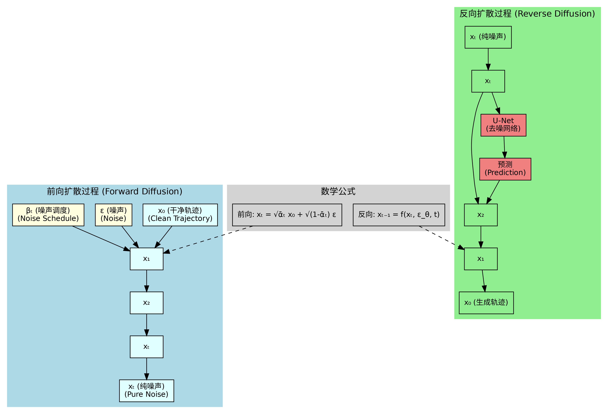

#### 4.1.2 数学/算法推导

扩散过程的核心数学原理基于马尔可夫链的变分推断。前向过程定义为一个固定的马尔可夫链，逐步向数据添加高斯噪声：

$$q(x_t|x_{t-1}) = \mathcal{N}(x_t; \sqrt{1-\beta_t}x_{t-1}, \beta_t I)$$

其中 $\beta_t$ 是预定义的噪声调度参数。通过重参数化技巧，可以直接从 $x_0$ 采样 $x_t$：

$$q(x_t|x_0) = \mathcal{N}(x_t; \sqrt{\bar{\alpha}_t}x_0, (1-\bar{\alpha}_t)I)$$

其中 $\bar{\alpha}_t = \prod_{s=1}^t (1-\beta_s)$。

反向过程则学习一个参数化的马尔可夫链来逐步去噪：

$$p_\theta(x_{t-1}|x_t) = \mathcal{N}(x_{t-1}; \mu_\theta(x_t, t), \Sigma_\theta(x_t, t))$$

#### 4.1.3 源码片段与讲解

```python
def compute_loss(self, batch: dict[str, Tensor]) -> Tensor:
    """Compute the diffusion loss."""
    # Encode image features and concatenate them all together along with the state vector.
    global_cond = self._prepare_global_conditioning(batch)  # (B, global_cond_dim)

    # Forward diffusion.
    trajectory = batch["action"]
    # Sample noise to add to the trajectory.
    eps = torch.randn(trajectory.shape, device=trajectory.device)
    # Sample a random noising timestep for each item in the batch.
    timesteps = torch.randint(
        low=0,
        high=self.noise_scheduler.config.num_train_timesteps,
        size=(trajectory.shape[0],),
        device=trajectory.device,
    ).long()
    # Add noise to the clean trajectories according to the noise magnitude at each timestep.
    noisy_trajectory = self.noise_scheduler.add_noise(trajectory, eps, timesteps)

    # Run the denoising network (that might denoise the trajectory, or attempt to predict the noise).
    pred = self.unet(noisy_trajectory, timesteps, global_cond=global_cond)

    # Compute the loss.
    # The target is either the original trajectory, or the noise.
    if self.config.prediction_type == "epsilon":
        target = eps
    elif self.config.prediction_type == "sample":
        target = batch["action"]
    else:
        raise ValueError(f"Unsupported prediction type {self.config.prediction_type}")

    loss = F.mse_loss(pred, target, reduction="none")
    return loss.mean()
```

这段代码展示了扩散过程损失计算的实现。方法首先准备全局条件特征，然后进行前向扩散过程：采样噪声和时间步，将噪声添加到干净的动作轨迹上。接着，U-Net网络预测去噪结果，最后计算预测与目标之间的MSE损失。支持两种预测类型：预测噪声（epsilon）或预测样本（sample）。

### 4.2 FiLM调制

#### 4.2.1 FiLM调制讲解

FiLM（Feature Linear Modulation）是一种条件调制技术，能够有效地将条件信息融入到神经网络的特征表示中。在Diffusion Policy中，FiLM被用来将观察信息调制到U-Net的特征中，实现条件生成。

FiLM调制的核心思想是通过学习缩放和偏置参数来调制特征。对于每个特征通道，FiLM生成一个缩放因子和一个偏置项，然后通过线性变换来调制特征：`modulated_feature = scale * feature + bias`。这种调制方式既简单又有效，能够保持特征的表达能力。

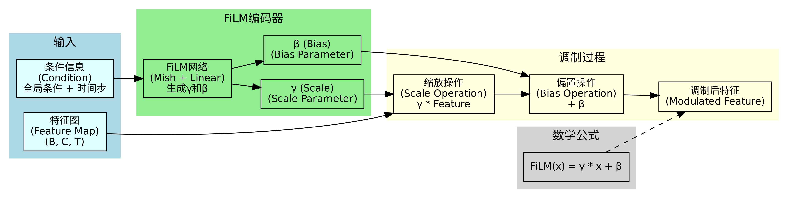

#### 4.2.2 数学/算法推导

FiLM调制的数学表达式为：

$$\text{FiLM}(x) = \gamma \odot x + \beta$$

其中 $x$ 是输入特征，$\gamma$ 和 $\beta$ 是条件网络生成的缩放和偏置参数，$\odot$ 表示逐元素乘法。

条件网络通常是一个多层感知机，接收条件信息 $c$ 并输出调制参数：

$$[\gamma, \beta] = f_\phi(c)$$

其中 $f_\phi$ 是参数化的条件网络。

#### 4.2.3 源码片段与讲解

```python
def forward(self, x: Tensor, cond: Tensor) -> Tensor:
    """
    Args:
        x: (B, in_channels, T)
        cond: (B, cond_dim)
    Returns:
        (B, out_channels, T)
    """
    out = self.conv1(x)

    # Get condition embedding. Unsqueeze for broadcasting to `out`, resulting in (B, out_channels, 1).
    cond_embed = self.cond_encoder(cond).unsqueeze(-1)
    if self.use_film_scale_modulation:
        # Treat the embedding as a list of scales and biases.
        scale = cond_embed[:, : self.out_channels]
        bias = cond_embed[:, self.out_channels :]
        out = scale * out + bias
    else:
        # Treat the embedding as biases.
        out = out + cond_embed

    out = self.conv2(out)
    out = out + self.residual_conv(x)
    return out
```

这段代码展示了FiLM调制的实现。方法首先通过第一个卷积层处理输入特征，然后通过条件编码器生成调制参数。如果启用缩放调制，则将条件嵌入分为缩放和偏置两部分，并应用到特征上。否则，只使用偏置调制。最后，通过第二个卷积层和残差连接完成处理。

### 4.3 空间软最大值

#### 4.3.1 空间软最大值讲解

空间软最大值（Spatial Softmax）是一种从2D特征图中提取关键点位置的技术，广泛应用于视觉-运动学习任务中。该技术能够将卷积特征图转换为空间坐标，为策略网络提供空间感知能力。

空间软最大值的核心思想是通过软最大值操作计算特征图中每个通道的"注意力中心"，然后与预定义的坐标网格进行点积，得到关键点的空间坐标。这种技术能够有效地将视觉特征转换为机器人控制所需的空间信息。

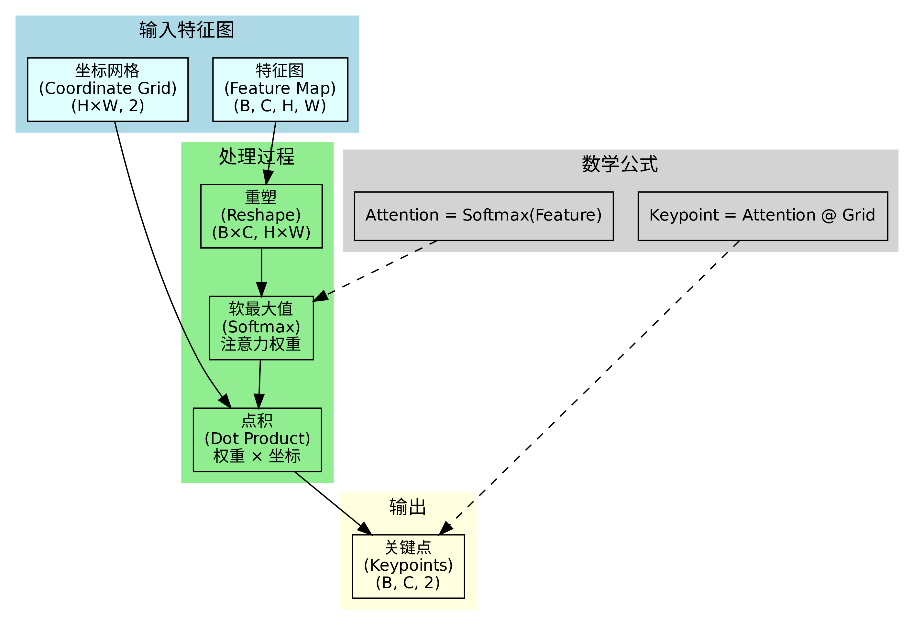

#### 4.3.2 数学/算法推导

空间软最大值的数学表达式为：

$$\text{Attention}_{i,j} = \frac{\exp(f_{i,j})}{\sum_{k,l} \exp(f_{k,l})}$$

其中 $f_{i,j}$ 是特征图中位置 $(i,j)$ 的激活值。

关键点坐标通过注意力权重与坐标网格的点积计算：

$$[x, y] = \sum_{i,j} \text{Attention}_{i,j} \cdot [x_{i,j}, y_{i,j}]$$

其中 $[x_{i,j}, y_{i,j}]$ 是预定义的坐标网格。

#### 4.3.3 源码片段与讲解

```python
def forward(self, features: Tensor) -> Tensor:
    """
    Args:
        features: (B, C, H, W) input feature maps.
    Returns:
        (B, K, 2) image-space coordinates of keypoints.
    """
    if self.nets is not None:
        features = self.nets(features)

    # [B, K, H, W] -> [B * K, H * W] where K is number of keypoints
    features = features.reshape(-1, self._in_h * self._in_w)
    # 2d softmax normalization
    attention = F.softmax(features, dim=-1)
    # [B * K, H * W] x [H * W, 2] -> [B * K, 2] for spatial coordinate mean in x and y dimensions
    expected_xy = attention @ self.pos_grid
    # reshape to [B, K, 2]
    feature_keypoints = expected_xy.view(-1, self._out_c, 2)

    return feature_keypoints
```

这段代码展示了空间软最大值的实现。方法首先对特征图进行可选的线性变换，然后将特征图重塑为二维矩阵。接着，通过软最大值操作计算注意力权重，并与预定义的坐标网格进行矩阵乘法，得到关键点的空间坐标。最后，将结果重塑为期望的输出形状。

### 4.4 1D卷积U-Net

#### 4.4.1 1D卷积U-Net讲解

1D卷积U-Net是Diffusion Policy的核心网络架构，专门设计用于处理时序数据。该网络采用编码器-解码器结构，通过跳跃连接保持细节信息，能够有效地建模时序动作序列的复杂分布。

1D卷积U-Net的主要特点包括：使用1D卷积处理时序数据，采用FiLM调制进行条件生成，通过跳跃连接保持细节信息，支持多尺度特征提取。这种设计使得网络能够有效地捕捉时序模式，生成高质量的动作序列。

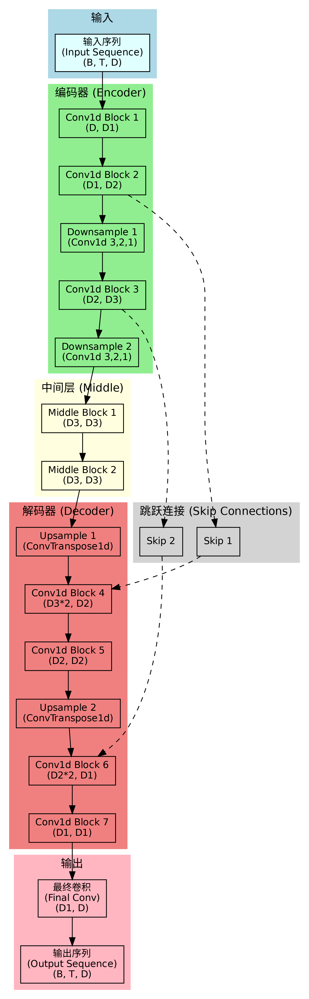

#### 4.4.2 源码片段与讲解

```python
def forward(self, x: Tensor, timestep: Tensor | int, global_cond=None) -> Tensor:
    """
    Args:
        x: (B, T, input_dim) tensor for input to the Unet.
        timestep: (B,) tensor of (timestep_we_are_denoising_from - 1).
        global_cond: (B, global_cond_dim)
        output: (B, T, input_dim)
    Returns:
        (B, T, input_dim) diffusion model prediction.
    """
    # For 1D convolutions we'll need feature dimension first.
    x = einops.rearrange(x, "b t d -> b d t")

    timesteps_embed = self.diffusion_step_encoder(timestep)

    # If there is a global conditioning feature, concatenate it to the timestep embedding.
    if global_cond is not None:
        global_feature = torch.cat([timesteps_embed, global_cond], axis=-1)
    else:
        global_feature = timesteps_embed

    # Run encoder, keeping track of skip features to pass to the decoder.
    encoder_skip_features: list[Tensor] = []
    for resnet, resnet2, downsample in self.down_modules:
        x = resnet(x, global_feature)
        x = resnet2(x, global_feature)
        encoder_skip_features.append(x)
        x = downsample(x)

    for mid_module in self.mid_modules:
        x = mid_module(x, global_feature)

    # Run decoder, using the skip features from the encoder.
    for resnet, resnet2, upsample in self.up_modules:
        x = torch.cat((x, encoder_skip_features.pop()), dim=1)
        x = resnet(x, global_feature)
        x = resnet2(x, global_feature)
        x = upsample(x)

    x = self.final_conv(x)

    x = einops.rearrange(x, "b d t -> b t d")
    return x
```

这段代码展示了1D卷积U-Net的前向传播过程。方法首先将输入重新排列为1D卷积所需的格式，然后编码时间步信息并与全局条件特征拼接。接着，通过编码器模块提取特征并保存跳跃连接信息。在中间层处理后，通过解码器模块逐步恢复特征，使用跳跃连接保持细节信息。最后，通过最终卷积层输出预测结果。

### 4.5 动作序列预测

#### 4.5.1 动作序列预测讲解

动作序列预测是Diffusion Policy的核心任务，它需要基于历史观察信息预测未来多个时间步的动作序列。这种预测能力使得机器人能够进行前瞻性的规划，而不是仅仅基于当前状态做出反应性的决策。

动作序列预测的关键挑战在于建模观察和动作之间的复杂时序关系。模型需要从历史观察中提取时序模式，理解任务目标，并生成合理的动作序列。扩散模型通过其强大的生成能力，能够捕捉动作序列的复杂分布，生成多样化和高质量的动作策略。

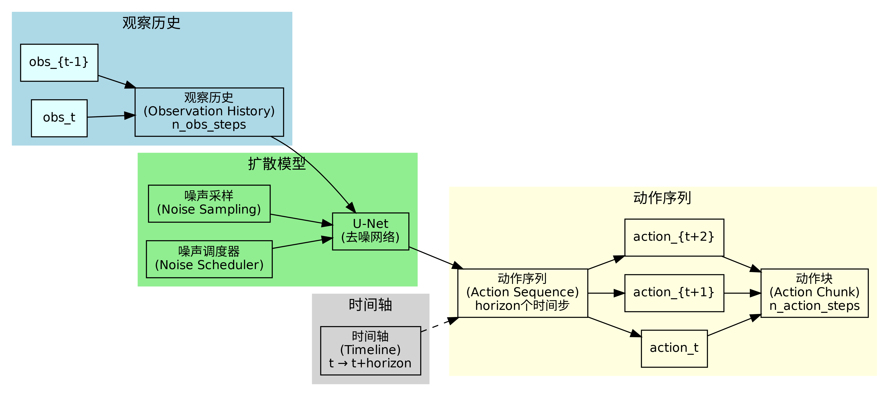

#### 4.5.2 源码片段与讲解

```python
def generate_actions(self, batch: dict[str, Tensor]) -> Tensor:
    """
    This function expects `batch` to have:
    {
        "observation.state": (B, n_obs_steps, state_dim)
        "observation.images": (B, n_obs_steps, num_cameras, C, H, W)
        AND/OR
        "observation.environment_state": (B, n_obs_steps, environment_dim)
    }
    """
    batch_size, n_obs_steps = batch["observation.state"].shape[:2]
    assert n_obs_steps == self.config.n_obs_steps

    # Encode image features and concatenate them all together along with the state vector.
    global_cond = self._prepare_global_conditioning(batch)  # (B, global_cond_dim)

    # run sampling
    actions = self.conditional_sample(batch_size, global_cond=global_cond)

    # Extract `n_action_steps` steps worth of actions (from the current observation).
    start = n_obs_steps - 1
    end = start + self.config.n_action_steps
    actions = actions[:, start:end]

    return actions
```

这段代码展示了动作序列预测的核心实现。方法首先验证输入数据的格式，然后准备全局条件特征。接着，通过条件扩散采样生成完整的动作序列。最后，从生成的序列中提取指定数量的动作步骤，作为当前时间步的执行动作。这种设计确保了动作序列的连续性和时序一致性。

## 总结

Diffusion Policy 通过创新的扩散模型架构，成功地将生成模型应用于机器人控制任务。其核心优势包括：

1. **强大的生成能力**：扩散模型能够捕捉动作序列的复杂分布，生成多样化和高质量的动作策略
2. **多模态融合**：能够有效处理机器人状态、视觉图像和环境状态等多种观察模态
3. **时序建模**：通过时序动作生成和队列缓存机制，实现了高效的时序推理
4. **条件生成**：通过FiLM调制等技术，实现了基于观察的条件动作生成

该模型在机器人控制任务中展现出了优异的性能，为端到端的视觉-运动学习提供了新的思路和方法。 