# SAC (Soft Actor-Critic) 学习文档

## 1. SAC概述

SAC (Soft Actor-Critic) 是LeRobot中实现的一种基于最大熵强化学习的离线策略Actor-Critic算法。该算法通过引入温度参数来平衡探索与利用，在机器人控制任务中表现出色。SAC的核心亮点在于其最大熵框架能够促进更好的探索，同时支持连续动作空间和混合动作空间（连续+离散），特别适合机器人操作任务。算法采用双Q网络架构减少过估计问题，并通过目标网络机制提高训练稳定性。

## 2. 模型架构

### 2.1 架构讲解

SAC模型采用经典的Actor-Critic架构，但在此基础上引入了最大熵强化学习的思想。整个架构包含以下几个核心组件：

**观测编码器 (SACObservationEncoder)**：负责处理多模态输入，包括机器人状态、图像观测和环境状态。对于图像输入，支持预训练的视觉编码器（如ResNet）或自定义CNN编码器，并通过空间嵌入层进行特征提取。

**Actor网络 (Policy)**：策略网络，输出连续动作的均值和标准差，通过Tanh变换确保动作在合理范围内。网络采用MLP结构，支持可学习的标准差。

**Critic网络 (CriticEnsemble)**：价值网络，采用集成学习方式，使用多个Q网络来减少过估计。每个Critic网络评估状态-动作对的价值。

**温度参数 (Temperature)**：可学习的温度参数，控制策略的随机性，平衡探索与利用。

**离散Critic (DiscreteCritic)**：可选的离散动作价值网络，用于处理混合动作空间中的离散动作（如夹爪控制）。

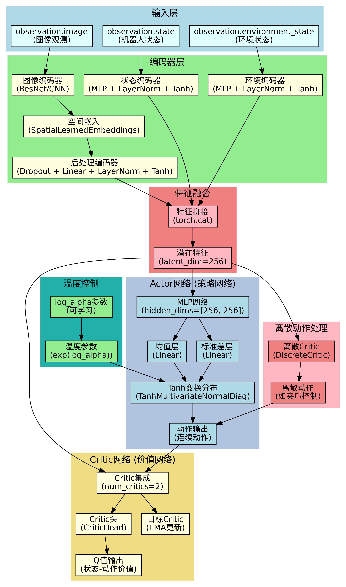

### 2.2 基于源码的神经网络结构图

SAC的神经网络结构在源码中体现为以下层次：

```python
# 核心网络组件
class SACPolicy(PreTrainedPolicy):
    def __init__(self, config, dataset_stats=None):
        self._init_normalization(dataset_stats)  # 输入输出标准化
        self._init_encoders()                    # 观测编码器
        self._init_critics(continuous_action_dim) # Critic网络
        self._init_actor(continuous_action_dim)   # Actor网络
        self._init_temperature()                  # 温度参数
```

网络结构的关键特点：
- **共享编码器**：Actor和Critic可以共享观测编码器以提高效率
- **集成Critic**：使用多个Critic网络减少过估计
- **目标网络**：通过指数移动平均更新目标网络
- **特征缓存**：当编码器被冻结时，可以缓存图像特征避免重复计算

### 2.3 基于源码的流程图

#### 2.3.1 训练流程图

SAC的训练过程分为三个主要阶段：Critic训练、Actor训练和温度参数训练。

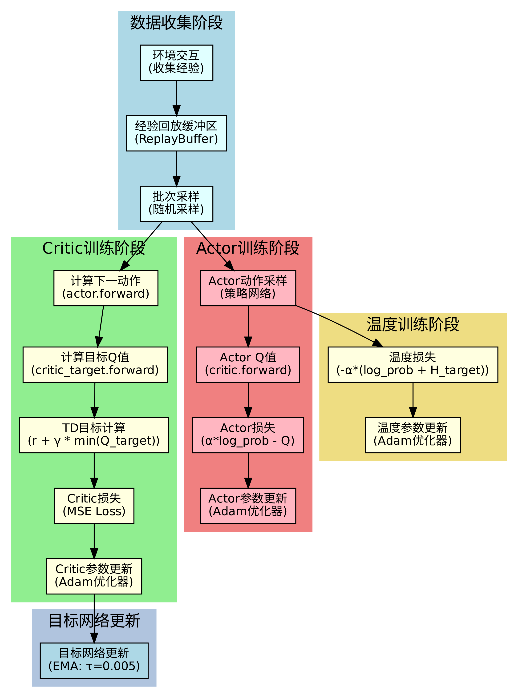

**Critic训练阶段**：
1. 从经验回放缓冲区采样批次数据
2. 使用Actor网络计算下一状态的动作
3. 通过目标Critic网络计算目标Q值
4. 计算TD目标：`r + γ * min(Q_target) - α * log_prob`
5. 使用MSE损失更新Critic网络

**Actor训练阶段**：
1. 使用当前策略采样动作
2. 通过Critic网络评估动作价值
3. 计算Actor损失：`α * log_prob - Q`
4. 更新Actor网络参数

**温度训练阶段**：
1. 计算温度损失：`-α * (log_prob + H_target)`
2. 更新温度参数以维持目标熵

#### 2.3.2 推理流程图

推理阶段主要关注高效的动作生成，通过特征缓存优化计算效率。

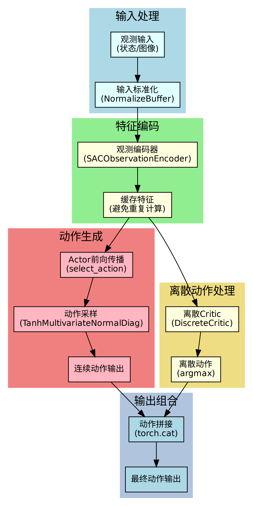

**推理流程**：
1. 输入观测数据并进行标准化
2. 通过观测编码器提取特征（支持缓存）
3. Actor网络生成连续动作
4. 可选的离散Critic生成离散动作
5. 拼接连续和离散动作作为最终输出

### 2.4 基于源码的函数调用关系图

SAC的函数调用关系体现了模块化设计思想，各组件职责明确。

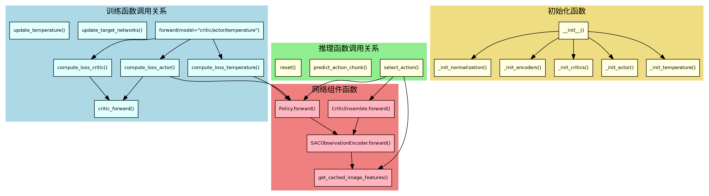

**核心函数调用关系**：
- `forward()` 方法根据模型类型调用相应的损失计算函数
- `select_action()` 方法调用Actor网络和可选的离散Critic
- 网络组件通过统一的编码器接口处理观测数据
- 初始化过程按顺序构建各个网络组件

## 3. 架构知识点

### 3.1 Actor-Critic架构

#### 3.1.1 Actor-Critic架构讲解

Actor-Critic架构是SAC的基础框架，它将策略学习和价值学习分离。Actor负责学习策略函数π(a|s)，直接输出动作；Critic负责学习价值函数Q(s,a)，评估状态-动作对的价值。这种分离使得算法能够处理连续动作空间，同时提供稳定的梯度信号。

#### 3.1.2 数学/算法推导

在Actor-Critic框架中，策略梯度定理给出：

∇θ J(θ) = E[∇θ log π(a|s) Q(s,a)]

其中J(θ)是策略目标函数，Q(s,a)是Critic网络提供的价值估计。

#### 3.1.3 Actor-Critic架构配图

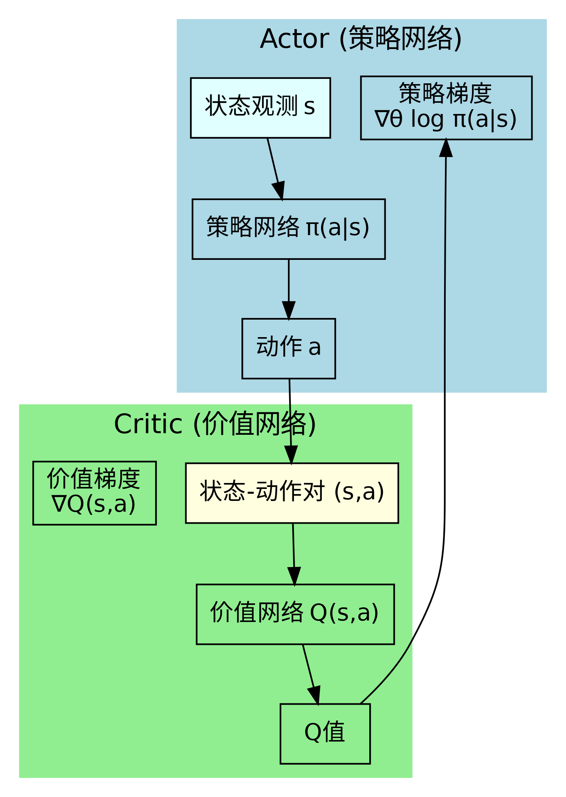

#### 3.1.4 源码片段与讲解

```python
# modeling_sac.py - Actor-Critic架构实现
class SACPolicy(PreTrainedPolicy):
    def _init_actor(self, continuous_action_dim):
        """初始化策略Actor网络"""
        self.actor = Policy(
            encoder=self.encoder_actor,
            network=MLP(input_dim=self.encoder_actor.output_dim, 
                       **asdict(self.config.actor_network_kwargs)),
            action_dim=continuous_action_dim,
            encoder_is_shared=self.shared_encoder,
            **asdict(self.config.policy_kwargs),
        )
    
    def _init_critics(self, continuous_action_dim):
        """初始化价值Critic网络"""
        heads = [CriticHead(...) for _ in range(self.config.num_critics)]
        self.critic_ensemble = CriticEnsemble(
            encoder=self.encoder_critic, 
            ensemble=heads, 
            output_normalization=self.normalize_targets
        )
```

源码体现了Actor-Critic的分离设计：Actor网络专注于策略学习，Critic网络专注于价值估计，两者通过共享的编码器处理观测数据。

### 3.2 最大熵强化学习

#### 3.2.1 最大熵强化学习讲解

最大熵强化学习在标准强化学习目标基础上增加了熵正则化项，鼓励策略保持一定的随机性。这有助于更好的探索，避免策略过早收敛到次优解。温度参数α控制熵的重要性，平衡探索与利用。

#### 3.2.2 数学/算法推导

最大熵强化学习的目标函数：

J(π) = E[∑(r_t + αH(π(·|s_t)))]

其中H(π(·|s_t))是策略在状态s_t下的熵，α是温度参数。

SAC中的Actor损失：

L_actor = E[α log π(a|s) - Q(s,a)]

温度损失：

L_temp = -α(log π(a|s) + H_target)

#### 3.2.3 最大熵强化学习配图

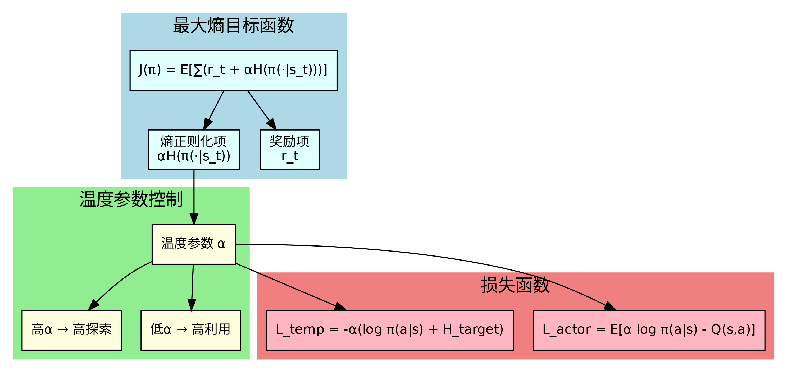

#### 3.2.4 源码片段与讲解

```python
# modeling_sac.py - 最大熵实现
def compute_loss_actor(self, observations, observation_features=None):
    """计算Actor损失，包含熵正则化"""
    actions_pi, log_probs, _ = self.actor(observations, observation_features)
    
    q_preds = self.critic_forward(observations, actions_pi, 
                                 use_target=False, observation_features=observation_features)
    min_q_preds = q_preds.min(dim=0)[0]
    
    # 最大熵损失：α * log_prob - Q
    actor_loss = ((self.temperature * log_probs) - min_q_preds).mean()
    return actor_loss

def compute_loss_temperature(self, observations, observation_features=None):
    """计算温度损失，自动调节温度参数"""
    with torch.no_grad():
        _, log_probs, _ = self.actor(observations, observation_features)
    # 温度损失：-α * (log_prob + H_target)
    temperature_loss = (-self.log_alpha.exp() * (log_probs + self.target_entropy)).mean()
    return temperature_loss
```

源码中温度参数通过可学习的log_alpha实现，通过温度损失自动调节，确保策略保持合适的信息熵。

### 3.3 目标网络机制

#### 3.3.1 目标网络机制讲解

目标网络机制是深度强化学习中的关键技术，用于稳定训练过程。通过维护一个目标网络，其参数通过指数移动平均缓慢更新，避免训练过程中的目标值剧烈变化，提高算法稳定性。

#### 3.3.2 数学/算法推导

目标网络参数更新：

θ_target = τ * θ + (1 - τ) * θ_target

其中τ是软更新系数（通常很小，如0.005），θ是主网络参数。

#### 3.3.3 目标网络机制配图

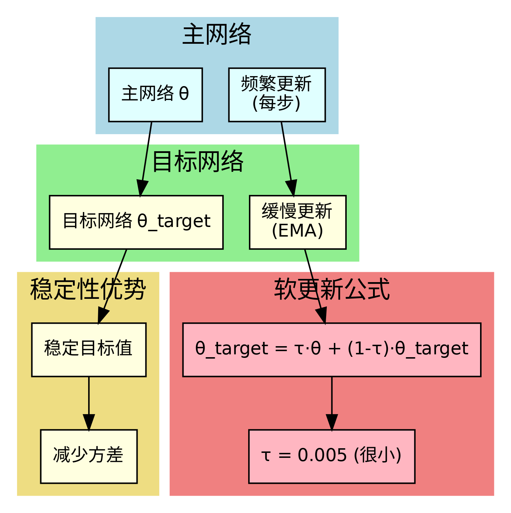

#### 3.3.4 源码片段与讲解

```python
# modeling_sac.py - 目标网络实现
def update_target_networks(self):
    """更新目标网络参数"""
    for target_param, param in zip(
        self.critic_target.parameters(),
        self.critic_ensemble.parameters(),
        strict=True,
    ):
        target_param.data.copy_(
            param.data * self.config.critic_target_update_weight
            + target_param.data * (1.0 - self.config.critic_target_update_weight)
        )
```

源码通过EMA方式更新目标网络，critic_target_update_weight对应τ参数，确保目标网络参数平滑更新。

### 3.4 集成学习

#### 3.4.1 集成学习讲解

SAC使用多个Critic网络组成集成，通过取最小值的方式减少Q值的过估计问题。这种设计源于Double Q-learning的思想，能够提高算法的稳定性和性能。

#### 3.4.2 数学/算法推导

集成Critic的Q值计算：

Q_min(s,a) = min(Q_1(s,a), Q_2(s,a), ..., Q_N(s,a))

TD目标计算：

TD_target = r + γ * Q_min(s', a') - α * log π(a'|s')

#### 3.4.3 集成学习配图

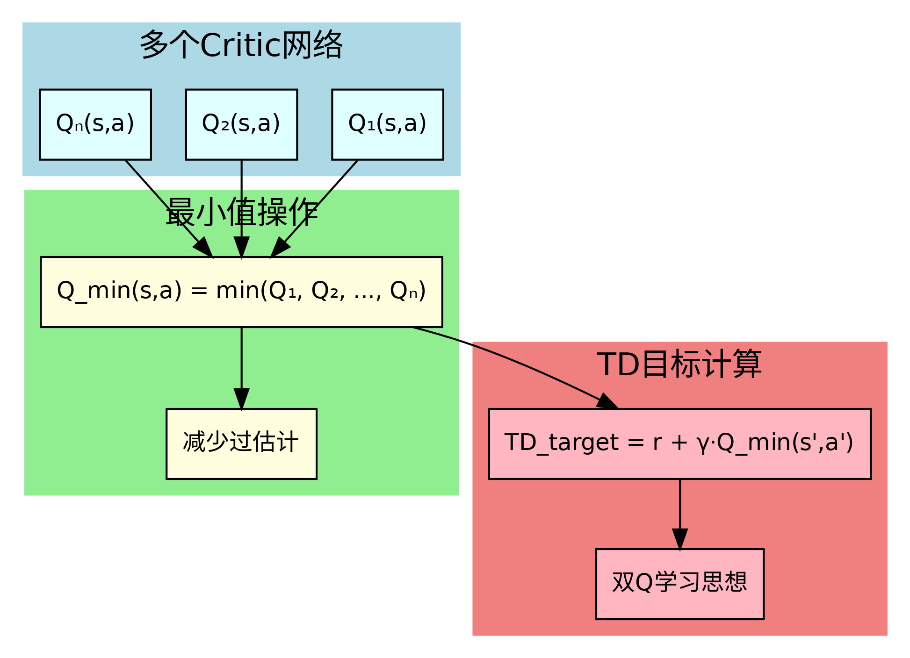

#### 3.4.4 源码片段与讲解

```python
# modeling_sac.py - 集成Critic实现
class CriticEnsemble(nn.Module):
    def forward(self, observations, actions, observation_features=None):
        # 通过所有Critic网络计算Q值
        q_values = []
        for critic in self.critics:
            q_values.append(critic(inputs))
        
        # 堆叠Q值 [num_critics, batch_size]
        q_values = torch.stack([q.squeeze(-1) for q in q_values], dim=0)
        return q_values

def compute_loss_critic(self, observations, actions, rewards, next_observations, done, ...):
    # 计算目标Q值时取最小值
    q_targets = self.critic_forward(next_observations, next_action_preds, use_target=True)
    min_q, _ = q_targets.min(dim=0)  # 取最小值
    td_target = rewards + (1 - done) * self.config.discount * min_q
```

源码实现了完整的集成Critic机制，通过多个Critic网络计算Q值，并在计算TD目标时取最小值。

## 4. 主要技术点

### 4.1 双Q网络

#### 4.1.1 双Q网络讲解

双Q网络是SAC中减少Q值过估计的核心技术。通过使用两个独立的Q网络，在计算TD目标时使用一个网络选择动作，另一个网络评估价值，有效避免了过估计问题。

#### 4.1.2 数学/算法推导

双Q网络的目标计算：

Q_target(s', a') = Q_2(s', argmax_a Q_1(s', a))

其中Q_1和Q_2是两个独立的Q网络。

#### 4.1.3 双Q网络配图

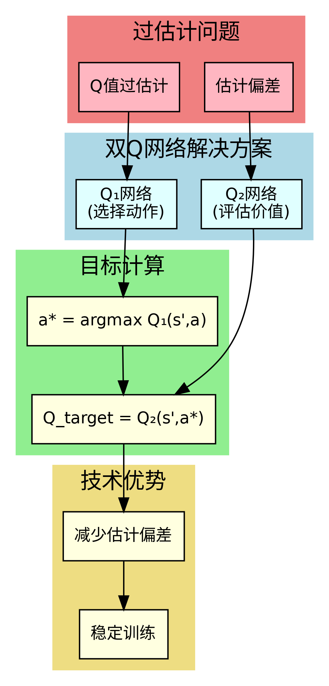

#### 4.1.4 源码片段与讲解

```python
# modeling_sac.py - 双Q网络实现
def compute_loss_critic(self, observations, actions, rewards, next_observations, done, ...):
    with torch.no_grad():
        next_action_preds, next_log_probs, _ = self.actor(next_observations, next_observation_features)
        
        # 使用目标Critic网络计算Q值
        q_targets = self.critic_forward(
            observations=next_observations,
            actions=next_action_preds,
            use_target=True,  # 使用目标网络
            observation_features=next_observation_features,
        )
        
        # 取最小值减少过估计
        min_q, _ = q_targets.min(dim=0)
        if self.config.use_backup_entropy:
            min_q = min_q - (self.temperature * next_log_probs)
        
        td_target = rewards + (1 - done) * self.config.discount * min_q
```

源码通过use_target参数区分主网络和目标网络，确保TD目标计算的稳定性。

### 4.2 温度自动调节

#### 4.2.1 温度自动调节讲解

温度自动调节是SAC的重要创新，通过可学习的温度参数α自动平衡探索与利用。温度参数通过最小化温度损失来调节，确保策略保持合适的信息熵。

#### 4.2.2 数学/算法推导

温度损失函数：

L(α) = -α * (log π(a|s) + H_target)

其中H_target是目标熵，通常设为动作空间维度的负值。

温度更新：

α = exp(log_α)

#### 4.2.3 温度自动调节配图

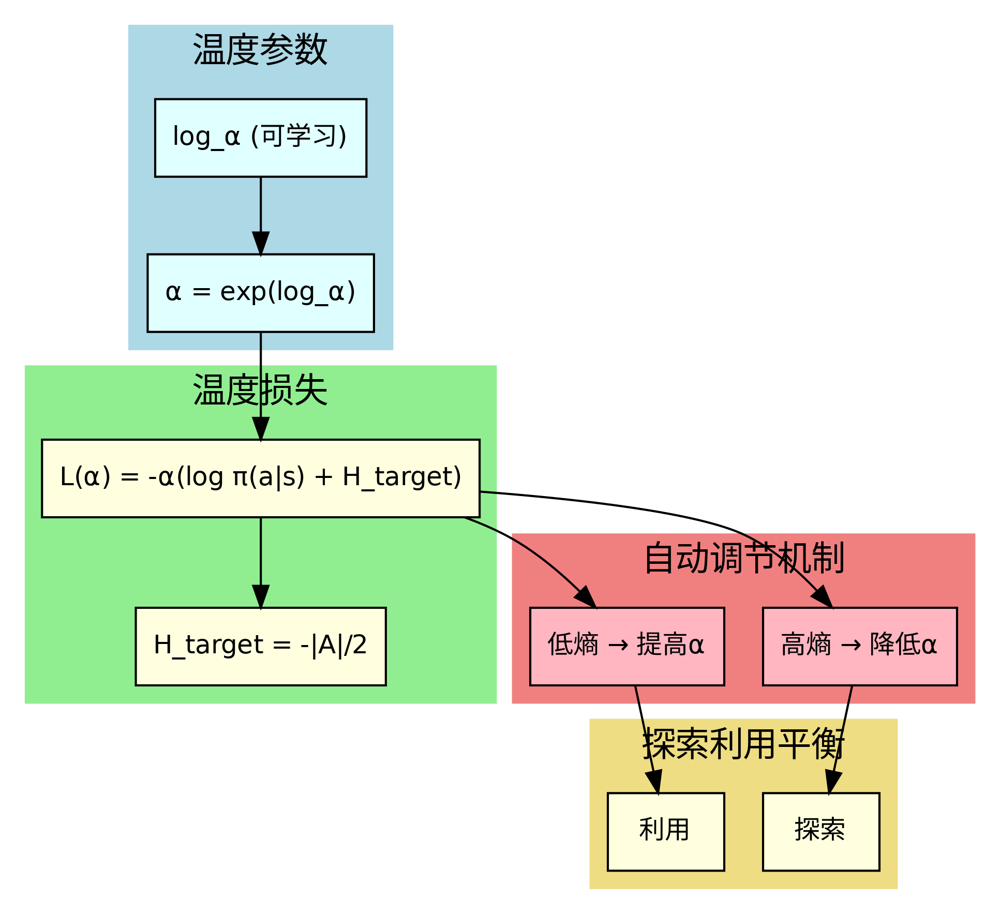

#### 4.2.4 源码片段与讲解

```python
# modeling_sac.py - 温度自动调节实现
def _init_temperature(self):
    """初始化温度参数"""
    temp_init = self.config.temperature_init
    self.log_alpha = nn.Parameter(torch.tensor([math.log(temp_init)]))
    self.temperature = self.log_alpha.exp().item()

def compute_loss_temperature(self, observations, observation_features=None):
    """计算温度损失"""
    with torch.no_grad():
        _, log_probs, _ = self.actor(observations, observation_features)
    # 温度损失：-α * (log_prob + H_target)
    temperature_loss = (-self.log_alpha.exp() * (log_probs + self.target_entropy)).mean()
    return temperature_loss

def update_temperature(self):
    """更新温度参数"""
    self.temperature = self.log_alpha.exp().item()
```

源码通过可学习的log_alpha参数实现温度自动调节，通过温度损失函数优化温度参数。

### 4.3 Tanh变换

#### 4.3.1 Tanh变换讲解

Tanh变换是SAC中处理连续动作空间的关键技术。通过Tanh函数将无界的动作分布映射到有界范围，确保动作在合理范围内，同时保持可微分性。

#### 4.3.2 数学/算法推导

Tanh变换：

a_tanh = tanh(a_raw)

其中a_raw是网络输出的原始动作，a_tanh是变换后的动作。

概率密度变换：

π_tanh(a) = π_raw(tanh^(-1)(a)) * |det(∂tanh/∂a)|

#### 4.3.3 Tanh变换配图

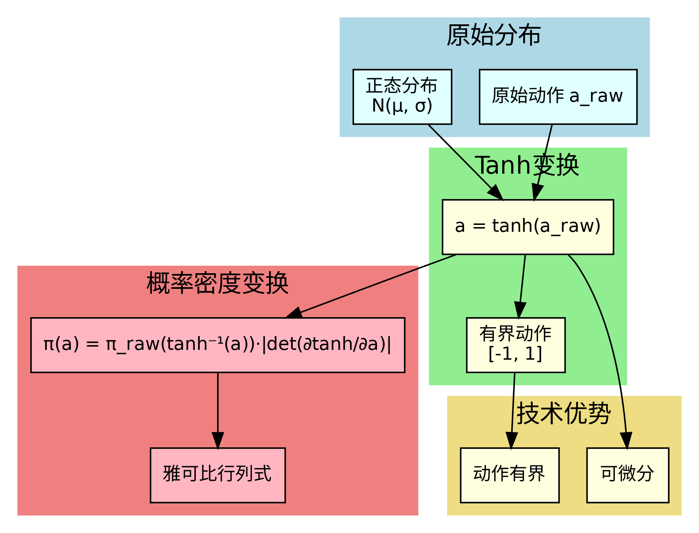

#### 4.3.4 源码片段与讲解

```python
# modeling_sac.py - Tanh变换实现
class TanhMultivariateNormalDiag(TransformedDistribution):
    def __init__(self, loc, scale_diag, low=None, high=None):
        base_dist = MultivariateNormal(loc, torch.diag_embed(scale_diag))
        transforms = [TanhTransform(cache_size=1)]
        
        if low is not None and high is not None:
            transforms.insert(0, RescaleFromTanh(low, high))
        
        super().__init__(base_dist, transforms)

class Policy(nn.Module):
    def forward(self, observations, observation_features=None):
        # 构建变换分布
        dist = TanhMultivariateNormalDiag(loc=means, scale_diag=std)
        
        # 采样动作（重参数化）
        actions = dist.rsample()
        
        # 计算log概率
        log_probs = dist.log_prob(actions)
        
        return actions, log_probs, means
```

源码通过TransformedDistribution实现Tanh变换，确保动作采样和概率计算的正确性。

### 4.4 图像编码器

#### 4.4.1 图像编码器讲解

SAC支持多种图像编码器，包括预训练的视觉模型（如ResNet）和自定义CNN。图像编码器负责从原始图像中提取有用的特征表示，为后续的策略和价值网络提供输入。

#### 4.4.2 数学/算法推导

图像编码过程：

f_img = Encoder(I)

其中I是输入图像，f_img是编码后的特征。

特征融合：

f_combined = Concat(f_img, f_state, f_env)

#### 4.4.3 图像编码器配图

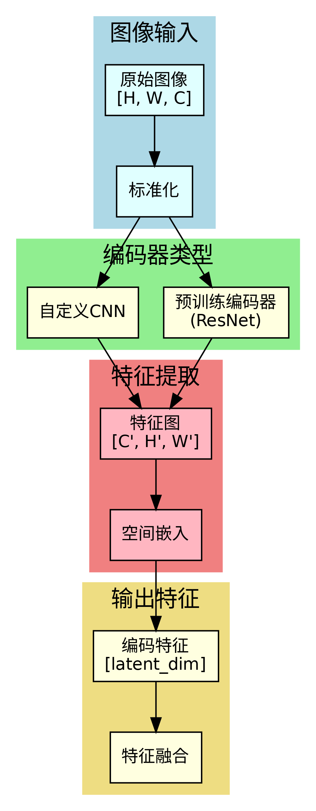

#### 4.4.4 源码片段与讲解

```python
# modeling_sac.py - 图像编码器实现
class SACObservationEncoder(nn.Module):
    def _init_image_layers(self):
        if self.config.vision_encoder_name is not None:
            self.image_encoder = PretrainedImageEncoder(self.config)
        else:
            self.image_encoder = DefaultImageEncoder(self.config)
        
        if self.config.freeze_vision_encoder:
            freeze_image_encoder(self.image_encoder)
        
        # 空间嵌入层
        self.spatial_embeddings = nn.ModuleDict()
        for key in self.image_keys:
            self.spatial_embeddings[key] = SpatialLearnedEmbeddings(
                height=height, width=width, channel=channels,
                num_features=self.config.image_embedding_pooling_dim,
            )

class PretrainedImageEncoder(nn.Module):
    def _load_pretrained_vision_encoder(self, config):
        from transformers import AutoModel
        self.image_enc_layers = AutoModel.from_pretrained(
            config.vision_encoder_name, trust_remote_code=True
        )
```

源码支持灵活的图像编码器配置，可以选择预训练模型或自定义CNN，并通过空间嵌入层进一步处理特征。

### 4.5 空间嵌入

#### 4.5.1 空间嵌入讲解

空间嵌入是SAC中处理图像特征的重要技术，通过学习空间位置编码来捕获图像中的空间关系。这种嵌入方式能够更好地保留图像的空间信息，提高特征表示的质量。

#### 4.5.2 数学/算法推导

空间嵌入计算：

E = Σ_{h,w} F[h,w,c] * K[c,h,w,f]

其中F是特征图，K是学习的空间核，E是嵌入结果。

#### 4.5.3 空间嵌入配图

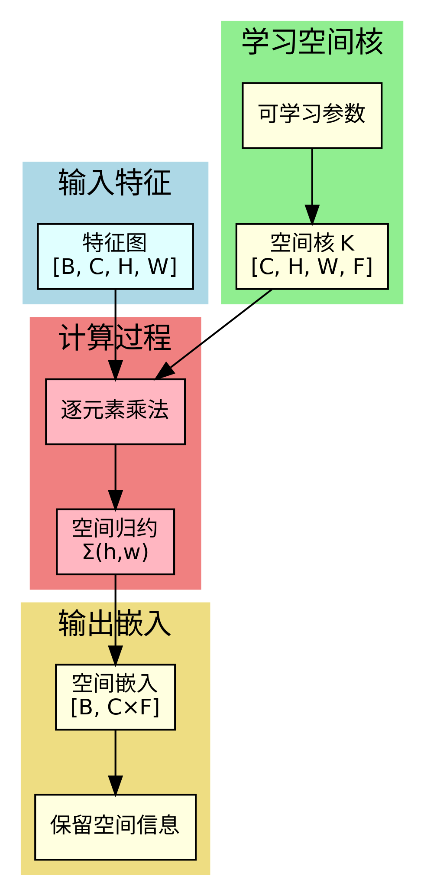

#### 4.5.4 源码片段与讲解

```python
# modeling_sac.py - 空间嵌入实现
class SpatialLearnedEmbeddings(nn.Module):
    def __init__(self, height, width, channel, num_features=8):
        super().__init__()
        self.kernel = nn.Parameter(torch.empty(channel, height, width, num_features))
        nn.init.kaiming_normal_(self.kernel, mode="fan_in", nonlinearity="linear")
    
    def forward(self, features):
        features_expanded = features.unsqueeze(-1)  # [B, C, H, W, 1]
        kernel_expanded = self.kernel.unsqueeze(0)  # [1, C, H, W, F]
        
        # 逐元素乘法和空间归约
        output = (features_expanded * kernel_expanded).sum(dim=(2, 3))
        output = output.view(output.size(0), -1)  # [B, C*F]
        
        return output
```

源码通过学习的空间核实现空间嵌入，能够自适应地学习重要的空间模式。

### 4.6 奖励分类器

#### 4.6.1 奖励分类器讲解

奖励分类器是SAC的可选组件，用于处理稀疏奖励场景。通过训练一个分类器来预测奖励信号，可以将稀疏奖励转换为密集奖励，提高学习效率。

#### 4.6.2 数学/算法推导

奖励分类器损失：

L_classifier = -y * log(p) - (1-y) * log(1-p)

其中y是真实奖励标签，p是预测的奖励概率。

#### 4.6.3 奖励分类器配图

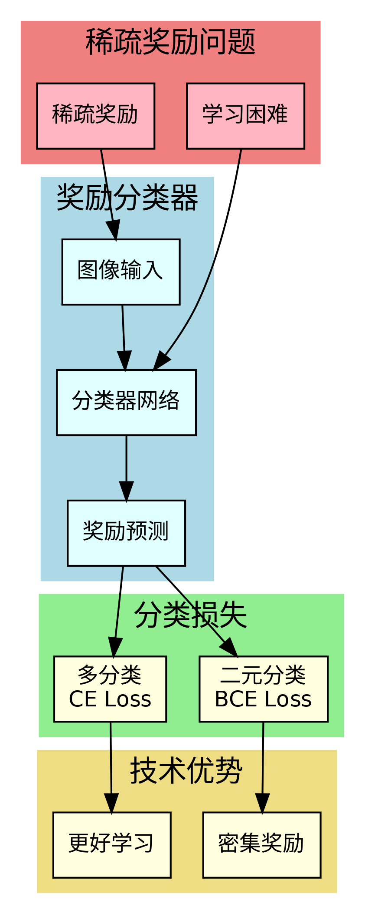

#### 4.6.4 源码片段与讲解

```python
# reward_model/modeling_classifier.py - 奖励分类器实现
class Classifier(PreTrainedPolicy):
    def forward(self, batch):
        # 提取图像和标签
        images, labels = self.extract_images_and_labels(batch)
        
        # 获取预测
        outputs = self.predict(images)
        
        # 计算损失
        if self.config.num_classes == 2:
            loss = nn.functional.binary_cross_entropy_with_logits(outputs.logits, labels)
        else:
            loss = nn.functional.cross_entropy(outputs.logits, labels.long())
        
        return loss, output_dict
```

源码实现了完整的奖励分类器，支持二分类和多分类任务，能够有效处理稀疏奖励问题。 