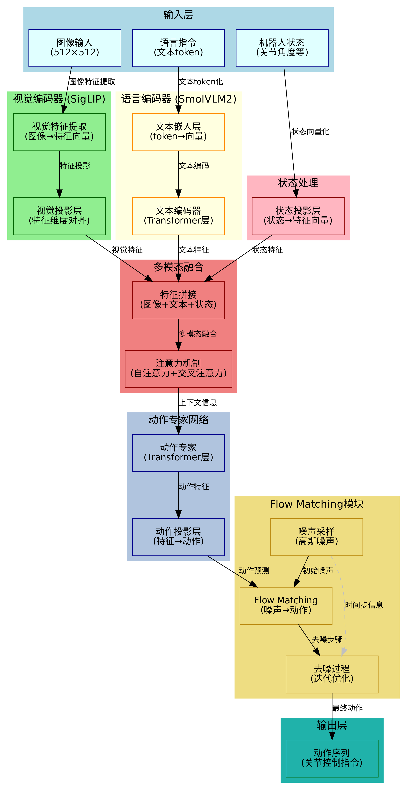
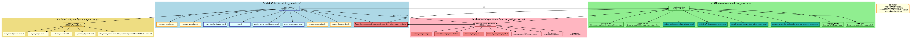
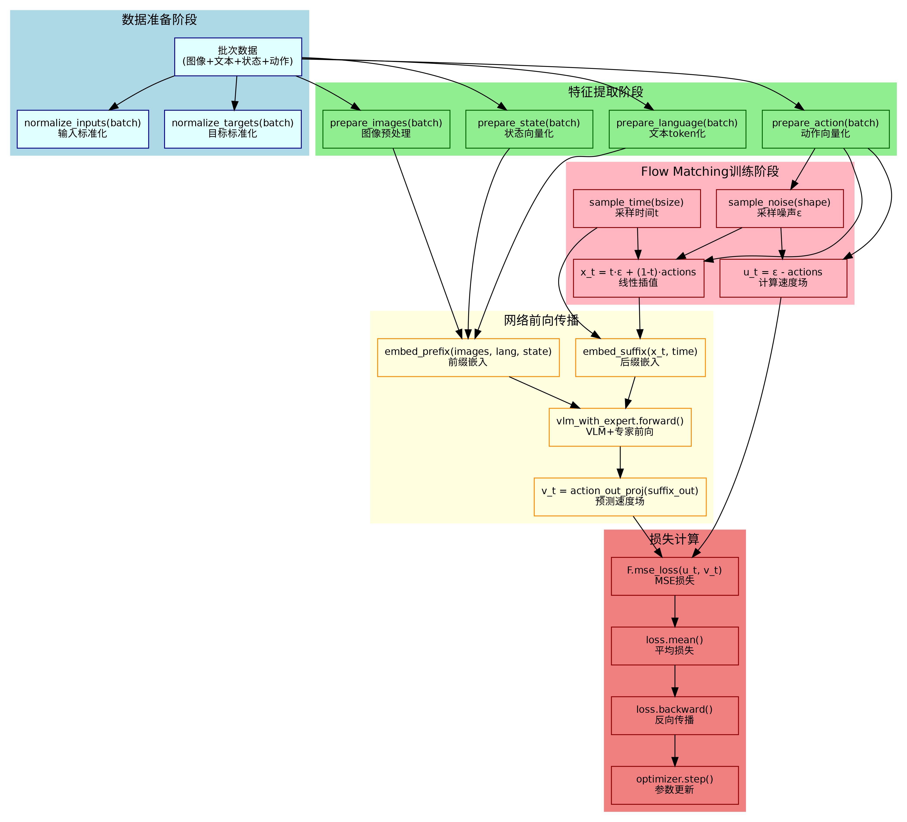
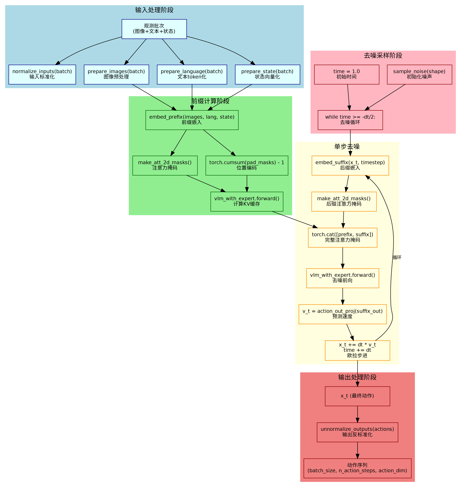
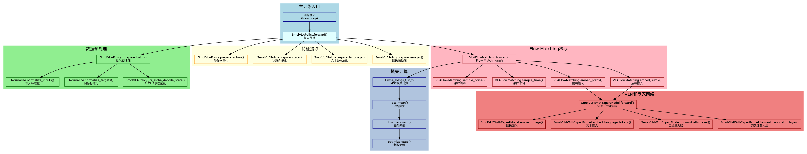
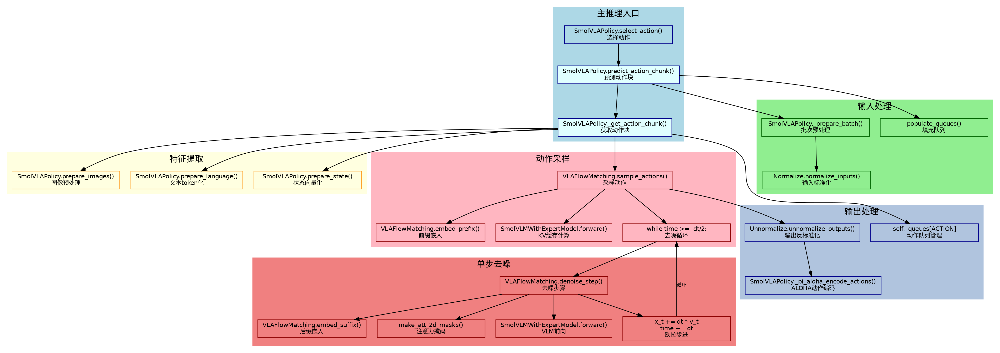
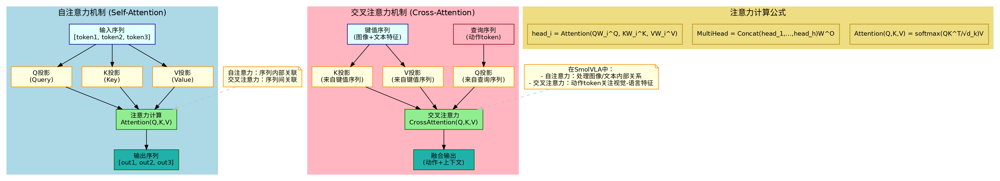
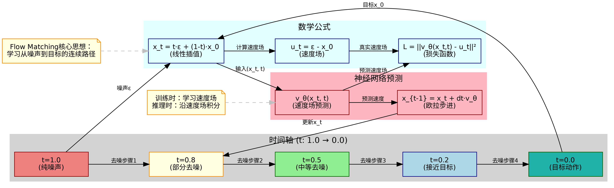

# SmolVLA学习文档

## 1. SmolVLA概述

SmolVLA是一个基于视觉-语言模型(VLM)的机器人动作生成模型，采用Flow Matching技术进行动作预测。该模型结合了预训练的SmolVLM2视觉-语言模型和专门的动作专家网络，能够根据图像观察、语言指令和机器人状态生成精确的动作序列。SmolVLA的主要亮点在于其高效的多模态融合架构、基于Flow Matching的连续动作生成技术，以及针对机器人控制任务的专门优化设计。

## 2. 模型架构

### 2.1 架构讲解

SmolVLA采用分层架构设计，主要包含四个核心组件：

1. **视觉编码器**：基于SigLIP的视觉特征提取模块，将输入图像转换为高维特征向量
2. **语言编码器**：基于SmolVLM2的文本理解模块，处理自然语言指令
3. **动作专家网络**：专门的动作生成模块，负责将多模态信息转换为动作序列
4. **Flow Matching模块**：基于概率流的动作生成技术，实现从噪声到目标动作的连续去噪过程

模型的核心思想是通过Flow Matching学习从噪声到目标动作的连续路径，在推理时通过迭代去噪生成精确的动作序列。这种设计既保证了生成动作的连续性和平滑性，又提高了训练和推理的效率。



### 2.2 基于源码的神经网络结构图

SmolVLA的源码实现主要包含以下几个核心类：

- **SmolVLAPolicy**：策略接口类，继承自PreTrainedPolicy，提供训练和推理的统一接口
- **VLAFlowMatching**：核心模型类，实现Flow Matching算法和网络前向传播
- **SmolVLMWithExpertModel**：VLM与专家网络的组合模型，处理多模态信息融合
- **SmolVLAConfig**：配置管理类，定义模型的各种超参数和设置



### 2.3 基于源码的流程图

#### 2.3.1 训练流程图

SmolVLA的训练流程主要包括以下步骤：

1. **数据准备**：对输入的图像、文本、状态和动作数据进行标准化处理
2. **特征提取**：分别处理图像、文本、状态和动作，转换为模型可用的特征向量
3. **Flow Matching训练**：采样噪声和时间，计算线性插值和速度场
4. **网络前向传播**：通过VLM和专家网络进行特征融合和预测
5. **损失计算**：计算预测速度场与真实速度场之间的MSE损失
6. **反向传播**：更新模型参数



#### 2.3.2 推理流程图

SmolVLA的推理流程主要包括以下步骤：

1. **输入处理**：对观测数据进行标准化和预处理
2. **前缀计算**：计算图像、文本、状态的前缀嵌入和KV缓存
3. **去噪采样**：初始化噪声，开始迭代去噪过程
4. **单步去噪**：在每一步中计算后缀嵌入、注意力掩码，进行去噪前向传播
5. **欧拉步进**：使用预测的速度场更新噪声，逐步接近目标动作
6. **输出处理**：对最终生成的动作进行反标准化处理



### 2.4 基于源码的函数调用关系图

#### 2.4.1 训练函数调用

训练时的主要函数调用链展示了从数据预处理到损失计算的完整流程：

```
SmolVLAPolicy.forward()
├── SmolVLAPolicy._prepare_batch()
│   ├── normalize_inputs()
│   └── normalize_targets()
├── VLAFlowMatching.forward()
│   ├── VLAFlowMatching.embed_prefix()
│   ├── VLAFlowMatching.embed_suffix()
│   └── SmolVLMWithExpertModel.forward()
│       ├── SmolVLMWithExpertModel.forward_attn_layer()
│       └── SmolVLMWithExpertModel.forward_cross_attn_layer()
└── F.mse_loss()
```



#### 2.4.2 推理函数调用

推理时的主要函数调用链展示了从输入处理到动作输出的完整流程：

```
SmolVLAPolicy.select_action()
├── SmolVLAPolicy.predict_action_chunk()
│   ├── SmolVLAPolicy._prepare_batch()
│   └── VLAFlowMatching.sample_actions()
│       ├── VLAFlowMatching.embed_prefix()
│       ├── SmolVLMWithExpertModel.forward() (KV缓存)
│       └── VLAFlowMatching.denoise_step() (循环)
│           ├── VLAFlowMatching.embed_suffix()
│           └── SmolVLMWithExpertModel.forward()
└── SmolVLAPolicy.unnormalize_outputs()
```



## 3. 架构知识点

### 3.1 多模态融合架构

#### 3.1.1 多模态融合架构讲解

SmolVLA采用创新的多模态融合架构，将视觉、语言和状态信息统一处理。该架构的核心思想是通过注意力机制实现不同模态信息的有效融合，使模型能够同时理解视觉场景、语言指令和机器人状态，从而生成准确的动作序列。

多模态融合的关键在于设计合适的注意力机制和特征对齐策略。SmolVLA使用前缀-后缀的序列设计，将图像和文本信息作为前缀，动作信息作为后缀，通过交叉注意力实现模态间的信息交互。

#### 3.1.2 多模态融合架构配图



#### 3.1.3 源码片段与讲解

```python
# modeling_smolvla.py - embed_prefix方法
def embed_prefix(self, images, img_masks, lang_tokens, lang_masks, state: torch.Tensor = None):
    """嵌入图像、语言和状态信息，准备多模态融合"""
    embs = []
    pad_masks = []
    att_masks = []
    
    # 处理图像特征
    for img, img_mask in zip(images, img_masks):
        img_emb = self.vlm_with_expert.embed_image(img)
        # 归一化图像嵌入
        img_emb_dim = img_emb.shape[-1]
        img_emb = img_emb * torch.tensor(img_emb_dim**0.5, dtype=img_emb.dtype, device=img_emb.device)
        embs.append(img_emb)
        pad_masks.append(img_mask)
        att_masks += [0] * img_emb.shape[1]
    
    # 处理语言特征
    lang_emb = self.vlm_with_expert.embed_language_tokens(lang_tokens)
    lang_emb_dim = lang_emb.shape[-1]
    lang_emb = lang_emb * math.sqrt(lang_emb_dim)
    embs.append(lang_emb)
    pad_masks.append(lang_masks)
    att_masks += [0] * lang_emb.shape[1]
    
    # 处理状态特征
    state_emb = self.state_proj(state)
    embs.append(state_emb)
    pad_masks.append(state_mask)
    att_masks += [1] * state_emb.shape[1]  # 状态不能关注动作
    
    return embs, pad_masks, att_masks
```

这段代码展示了多模态融合的核心实现。通过分别处理图像、语言和状态信息，然后将它们拼接成一个统一的序列，通过注意力掩码控制不同模态间的交互权限。

### 3.2 专家网络设计

#### 3.2.1 专家网络设计讲解

SmolVLA采用VLM与动作专家网络的分层架构设计。VLM负责处理视觉和语言信息，提供丰富的语义理解能力；动作专家网络专门负责动作生成，具有更小的参数量和更高的计算效率。

专家网络的设计考虑了机器人控制任务的特点，使用较少的层数和较小的隐藏维度，但保持了与VLM的兼容性。通过交叉注意力机制，动作专家网络能够访问VLM的视觉-语言特征，实现知识的有效传递。

#### 3.2.2 专家网络设计配图


#### 3.2.3 源码片段与讲解

```python
# smolvlm_with_expert.py - SmolVLMWithExpertModel初始化
class SmolVLMWithExpertModel(nn.Module):
    def __init__(self, model_id, load_vlm_weights=True, train_expert_only=True, 
                 num_expert_layers=-1, expert_width_multiplier=0.5):
        super().__init__()
        
        # 加载预训练的VLM
        self.vlm = AutoModelForImageTextToText.from_pretrained(model_id)
        
        # 创建动作专家网络
        lm_expert_config = copy.deepcopy(config.text_config)
        hidden_size = lm_expert_config.hidden_size
        lm_expert_config.hidden_size = int(hidden_size * expert_width_multiplier)
        lm_expert_config.num_hidden_layers = self.num_vlm_layers
        
        if num_expert_layers > 0:
            lm_expert_config.num_hidden_layers = num_expert_layers
            
        self.lm_expert = AutoModel.from_config(lm_expert_config)
```

这段代码展示了专家网络的创建过程。通过复制VLM的配置并调整隐藏维度和层数，创建了一个专门的动作专家网络。`expert_width_multiplier`参数控制专家网络的宽度，`num_expert_layers`参数控制专家网络的深度。

### 3.3 注意力机制设计

#### 3.3.1 注意力机制设计讲解

SmolVLA采用自注意力和交叉注意力交替使用的设计。自注意力用于处理同一模态内部的关联关系，交叉注意力用于实现不同模态间的信息交互。这种设计既保证了模态内部的特征提取能力，又实现了模态间的有效融合。

注意力机制的核心在于设计合适的注意力掩码，控制不同token之间的交互权限。SmolVLA使用前缀-后缀的设计，前缀部分（图像、文本、状态）可以相互关注，后缀部分（动作）可以关注前缀，但前缀不能关注后缀。

#### 3.3.2 注意力机制设计配图


#### 3.3.3 源码片段与讲解

```python
# smolvlm_with_expert.py - forward方法
def forward(self, attention_mask, position_ids, past_key_values, inputs_embeds):
    models = [self.get_vlm_model().text_model, self.lm_expert]
    model_layers = self.get_model_layers(models)
    
    for layer_idx in range(num_layers):
        if (fill_kv_cache or "cross" not in self.attention_mode or 
            (self.self_attn_every_n_layers > 0 and layer_idx % self.self_attn_every_n_layers == 0)):
            # 使用自注意力
            att_outputs, past_key_values = self.forward_attn_layer(...)
        else:
            # 使用交叉注意力
            att_outputs, past_key_values = self.forward_cross_attn_layer(...)
```

这段代码展示了注意力机制的切换逻辑。根据配置和层数，模型在自注意力和交叉注意力之间切换，实现不同模态间的有效交互。

### 3.4 序列建模

#### 3.4.1 序列建模讲解

SmolVLA采用序列建模的方式处理时间序列动作。模型将动作序列作为一个整体进行建模，通过Flow Matching技术学习从噪声到目标动作序列的连续路径。这种设计既保证了动作序列的连续性和平滑性，又提高了生成效率。

序列建模的关键在于设计合适的序列结构和位置编码。SmolVLA使用前缀-后缀的序列设计，前缀包含图像、文本和状态信息，后缀包含动作信息。通过位置编码和注意力掩码，模型能够正确处理序列中的位置关系。

#### 3.4.2 序列建模配图


#### 3.4.3 源码片段与讲解

```python
# modeling_smolvla.py - forward方法
def forward(self, images, img_masks, lang_tokens, lang_masks, state, actions, noise=None, time=None):
    # 采样噪声和时间
    if noise is None:
        noise = self.sample_noise(actions.shape, actions.device)
    if time is None:
        time = self.sample_time(actions.shape[0], actions.device)
    
    # 计算线性插值和速度场
    time_expanded = time[:, None, None]
    x_t = time_expanded * noise + (1 - time_expanded) * actions
    u_t = noise - actions
    
    # 嵌入前缀和后缀
    prefix_embs, prefix_pad_masks, prefix_att_masks = self.embed_prefix(...)
    suffix_embs, suffix_pad_masks, suffix_att_masks = self.embed_suffix(x_t, time)
    
    # 拼接序列
    pad_masks = torch.cat([prefix_pad_masks, suffix_pad_masks], dim=1)
    att_masks = torch.cat([prefix_att_masks, suffix_att_masks], dim=1)
    
    # 计算注意力掩码和位置编码
    att_2d_masks = make_att_2d_masks(pad_masks, att_masks)
    position_ids = torch.cumsum(pad_masks, dim=1) - 1
```

这段代码展示了序列建模的核心实现。通过将前缀和后缀拼接成一个完整的序列，使用注意力掩码控制不同部分间的交互，通过位置编码保持序列的位置信息。

## 4. 主要技术点

### 4.1 Flow Matching

#### 4.1.1 Flow Matching讲解

Flow Matching是一种基于概率流的生成模型技术，通过学习从噪声到目标的连续路径来生成数据。与传统的扩散模型不同，Flow Matching直接学习速度场，避免了复杂的噪声调度设计，具有更快的收敛速度和更高的生成质量。

在SmolVLA中，Flow Matching用于生成连续的动作序列。模型学习从高斯噪声到目标动作序列的速度场，在推理时通过欧拉积分沿着速度场生成动作。这种方法既保证了生成动作的连续性和平滑性，又提高了训练和推理的效率。

#### 4.1.2 数学/算法推导

Flow Matching的核心数学公式：

1. **线性插值路径**：$x_t = t \cdot \epsilon + (1-t) \cdot x_0$
   - $x_t$：时间步$t$的插值状态
   - $\epsilon$：高斯噪声
   - $x_0$：目标动作序列
   - $t \in [0,1]$：时间参数

2. **速度场**：$u_t = \epsilon - x_0$
   - $u_t$：真实速度场
   - 表示从噪声到目标的瞬时速度

3. **损失函数**：$L = \|v_\theta(x_t, t) - u_t\|^2$
   - $v_\theta$：神经网络预测的速度场
   - 目标是最小化预测速度场与真实速度场的差异

4. **推理过程**：$x_{t-1} = x_t + dt \cdot v_\theta(x_t, t)$
   - 使用欧拉积分沿速度场更新状态

#### 4.1.3 Flow Matching配图



#### 4.1.4 源码片段与讲解

```python
# modeling_smolvla.py - forward方法中的Flow Matching实现
def forward(self, images, img_masks, lang_tokens, lang_masks, state, actions, noise=None, time=None):
    # 采样噪声和时间
    if noise is None:
        noise = self.sample_noise(actions.shape, actions.device)
    if time is None:
        time = self.sample_time(actions.shape[0], actions.device)
    
    # 计算线性插值 x_t = t·ε + (1-t)·x_0
    time_expanded = time[:, None, None]
    x_t = time_expanded * noise + (1 - time_expanded) * actions
    
    # 计算速度场 u_t = ε - x_0
    u_t = noise - actions
    
    # 网络前向传播预测速度场
    prefix_embs, prefix_pad_masks, prefix_att_masks = self.embed_prefix(...)
    suffix_embs, suffix_pad_masks, suffix_att_masks = self.embed_suffix(x_t, time)
    
    # 通过VLM+专家网络预测速度场
    (_, suffix_out), _ = self.vlm_with_expert.forward(...)
    v_t = self.action_out_proj(suffix_out)
    
    # 计算MSE损失
    losses = F.mse_loss(u_t, v_t, reduction="none")
    return losses
```

这段代码展示了Flow Matching的完整实现。通过采样噪声和时间，计算线性插值和真实速度场，然后通过网络预测速度场，最后计算MSE损失。整个过程体现了Flow Matching的核心思想。

### 4.2 RoPE位置编码

#### 4.2.1 RoPE位置编码讲解

RoPE（Rotary Position Embedding）是一种相对位置编码技术，通过旋转操作将位置信息编码到token的表示中。与绝对位置编码不同，RoPE能够更好地处理长序列和相对位置关系，在Transformer模型中得到了广泛应用。

在SmolVLA中，RoPE用于编码序列中token的位置信息。由于模型需要处理不同长度的序列（图像特征、文本token、动作序列），RoPE能够有效地处理这些变长序列的位置编码问题。

#### 4.2.2 数学/算法推导

RoPE的核心数学公式：

1. **旋转矩阵**：对于维度$d$的向量，将其分为$d/2$个2D平面
2. **旋转操作**：$R_\theta = \begin{bmatrix} \cos\theta & -\sin\theta \\ \sin\theta & \cos\theta \end{bmatrix}$
3. **位置编码**：$\theta_m = m \cdot \theta_1$，其中$m$是位置，$\theta_1$是基础角度
4. **应用旋转**：$x' = R_\theta \cdot x$

#### 4.2.3 RoPE位置编码配图


#### 4.2.4 源码片段与讲解

```python
# smolvlm_with_expert.py - apply_rope函数
def apply_rope(x, positions, max_wavelength=10_000):
    """应用RoPE位置编码到输入张量"""
    d_half = x.shape[-1] // 2
    device = x.device
    dtype = x.dtype
    x = x.to(torch.float32)
    
    # 计算频率指数
    freq_exponents = (2.0 / x.shape[-1]) * torch.arange(d_half, dtype=torch.float32, device=device)
    timescale = max_wavelength**freq_exponents
    
    # 计算弧度
    radians = positions[..., None].to(torch.float32) / timescale[None, None, :].to(torch.float32)
    radians = radians[..., None, :]
    
    # 计算sin和cos
    sin = torch.sin(radians)
    cos = torch.cos(radians)
    
    # 分割输入并应用旋转
    x1, x2 = x.split(d_half, dim=-1)
    res = torch.empty_like(x)
    res[..., :d_half] = x1 * cos - x2 * sin
    res[..., d_half:] = x2 * cos + x1 * sin
    
    return res.to(dtype)
```

这段代码展示了RoPE位置编码的实现。通过计算频率指数和时间尺度，将位置信息转换为弧度，然后应用旋转操作到输入张量上。这种实现方式既高效又准确。

### 4.3 KV缓存机制

#### 4.3.1 KV缓存机制讲解

KV缓存机制是Transformer推理优化的重要技术，通过缓存之前计算的key和value，避免重复计算，显著提高推理效率。在SmolVLA中，KV缓存用于优化推理过程，特别是处理长序列时的计算效率。

KV缓存的核心思想是在推理时，对于已经计算过的token，将其key和value缓存起来，在后续的计算中直接使用缓存的值，而不需要重新计算。这种方法特别适用于自回归生成和流式推理场景。

#### 4.3.2 KV缓存机制配图


#### 4.3.3 源码片段与讲解

```python
# modeling_smolvla.py - sample_actions方法中的KV缓存
def sample_actions(self, images, img_masks, lang_tokens, lang_masks, state, noise=None):
    # 计算前缀嵌入
    prefix_embs, prefix_pad_masks, prefix_att_masks = self.embed_prefix(...)
    prefix_att_2d_masks = make_att_2d_masks(prefix_pad_masks, prefix_att_masks)
    prefix_position_ids = torch.cumsum(prefix_pad_masks, dim=1) - 1
    
    # 计算图像和语言的KV缓存
    _, past_key_values = self.vlm_with_expert.forward(
        attention_mask=prefix_att_2d_masks,
        position_ids=prefix_position_ids,
        past_key_values=None,
        inputs_embeds=[prefix_embs, None],
        use_cache=self.config.use_cache,
        fill_kv_cache=True,  # 填充KV缓存
    )
    
    # 去噪循环中使用缓存
    while time >= -dt / 2:
        v_t = self.denoise_step(
            prefix_pad_masks,
            past_key_values,  # 使用缓存的KV
            x_t,
            expanded_time,
        )
```

这段代码展示了KV缓存的实现。在推理开始时计算前缀的KV缓存，然后在去噪循环中重复使用这些缓存，避免重复计算前缀部分的key和value。

### 4.4 多模态嵌入

#### 4.4.1 多模态嵌入讲解

多模态嵌入是将不同模态的信息（图像、文本、状态）映射到统一的向量空间的技术。在SmolVLA中，多模态嵌入用于将视觉、语言和状态信息转换为模型可处理的统一表示。

多模态嵌入的关键在于设计合适的投影层和归一化策略。SmolVLA使用线性投影层将不同模态的特征映射到相同的维度，然后通过注意力机制实现模态间的交互。同时，使用适当的归一化策略确保不同模态的特征在数值上具有可比性。

#### 4.4.2 多模态嵌入配图


#### 4.4.3 源码片段与讲解

```python
# modeling_smolvla.py - embed_prefix方法中的多模态嵌入
def embed_prefix(self, images, img_masks, lang_tokens, lang_masks, state: torch.Tensor = None):
    embs = []
    pad_masks = []
    att_masks = []
    
    # 图像嵌入
    for img, img_mask in zip(images, img_masks):
        img_emb = self.vlm_with_expert.embed_image(img)
        # 归一化图像嵌入
        img_emb_dim = img_emb.shape[-1]
        img_emb = img_emb * torch.tensor(img_emb_dim**0.5, dtype=img_emb.dtype, device=img_emb.device)
        embs.append(img_emb)
        pad_masks.append(img_mask)
        att_masks += [0] * img_emb.shape[1]
    
    # 语言嵌入
    lang_emb = self.vlm_with_expert.embed_language_tokens(lang_tokens)
    # 归一化语言嵌入
    lang_emb_dim = lang_emb.shape[-1]
    lang_emb = lang_emb * math.sqrt(lang_emb_dim)
    embs.append(lang_emb)
    pad_masks.append(lang_masks)
    att_masks += [0] * lang_emb.shape[1]
    
    # 状态嵌入
    state_emb = self.state_proj(state)  # 线性投影
    state_emb = state_emb[:, None, :] if state_emb.ndim == 2 else state_emb
    embs.append(state_emb)
    pad_masks.append(state_mask)
    att_masks += [1] * state_emb.shape[1]  # 状态不能关注动作
    
    # 拼接所有嵌入
    embs = torch.cat(embs, dim=1)
    pad_masks = torch.cat(pad_masks, dim=1)
    att_masks = torch.tensor(att_masks, dtype=torch.bool, device=pad_masks.device)
    
    return embs, pad_masks, att_masks
```

这段代码展示了多模态嵌入的完整实现。通过分别处理图像、语言和状态信息，使用适当的归一化策略，然后将它们拼接成一个统一的序列。通过注意力掩码控制不同模态间的交互权限。

## 总结

SmolVLA是一个创新的机器人动作生成模型，通过结合视觉-语言模型和Flow Matching技术，实现了高效、准确的多模态动作生成。其核心优势在于：

1. **高效的多模态融合**：通过注意力机制实现视觉、语言、状态信息的有效融合
2. **连续的动作生成**：基于Flow Matching技术生成平滑、连续的动作序列
3. **模块化的架构设计**：VLM与动作专家网络的分层设计，既保证了语义理解能力，又提高了计算效率
4. **优化的推理性能**：通过KV缓存等优化技术，实现了高效的推理过程

SmolVLA为机器人控制领域提供了一个新的技术方向，展示了多模态AI在机器人应用中的巨大潜力。 